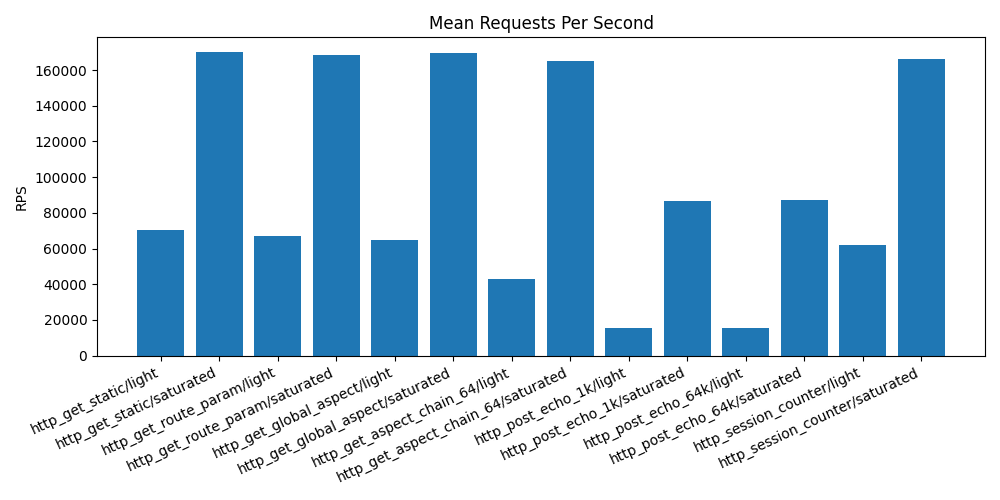

# Benchmark Report

## Environment

- timestamp_utc: `2026-03-25T18:43:51Z`
- os: `Linux 6.19.8-200.fc43.x86_64 x86_64`
- compiler: `GNU 15.2.1`
- build_type: `Release`
- logical_cpu_count: `20`

## Run Config

- scenario: `all`
- profile: `quick`
- pressure: `profile-default`
- client_processes: `4`
- wrk_threads_per_process: `1`
- repetitions: `2`

## Scenario Summary

| scenario | mean_rps | p95_us | p99_us | failure_ratio_max | stability |
| --- | ---: | ---: | ---: | ---: | --- |
| http_get_static/light | 70188.07 | 23.61 | 28.50 | 0.0000 | unstable |
| http_get_static/saturated | 169860.64 | 1053.81 | 1124.85 | 0.0000 | stable |
| http_get_route_param/light | 67146.45 | 51.33 | 78.00 | 0.0000 | stable |
| http_get_route_param/saturated | 168686.03 | 1060.95 | 1133.70 | 0.0000 | stable |
| http_get_global_aspect/light | 64570.97 | 50.50 | 76.50 | 0.0000 | stable |
| http_get_global_aspect/saturated | 169518.55 | 1053.28 | 1124.99 | 0.0000 | stable |
| http_get_aspect_chain_64/light | 42755.16 | 45.44 | 61.00 | 0.0000 | stable |
| http_get_aspect_chain_64/saturated | 165265.67 | 1089.03 | 1161.25 | 0.0000 | stable |
| http_post_echo_1k/light | 15315.65 | 96.28 | 154.50 | 0.0000 | stable |
| http_post_echo_1k/saturated | 86867.83 | 1877.81 | 1989.99 | 0.0000 | stable |
| http_post_echo_64k/light | 15317.74 | 99.28 | 157.50 | 0.0000 | stable |
| http_post_echo_64k/saturated | 87109.67 | 1841.53 | 1968.74 | 0.0000 | stable |
| http_session_counter/light | 62212.42 | 84.22 | 136.00 | 0.0000 | stable |
| http_session_counter/saturated | 165989.68 | 7656.91 | 13002.44 | 0.0000 | stable |

## Plots

