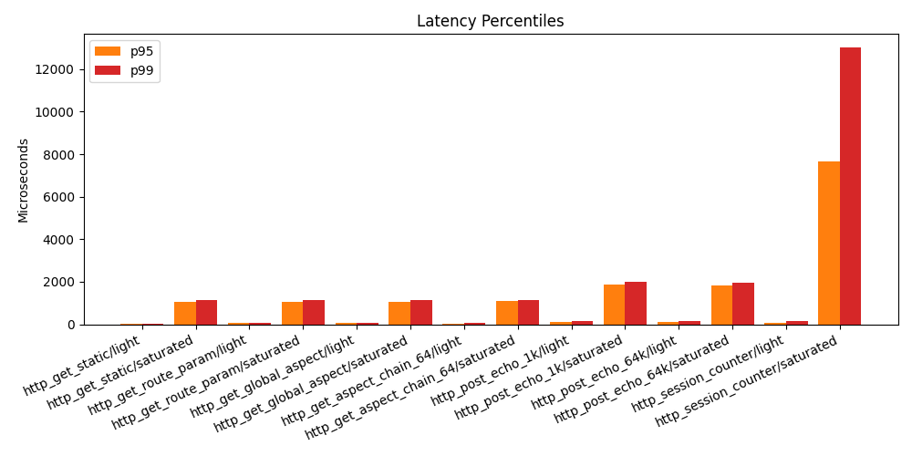
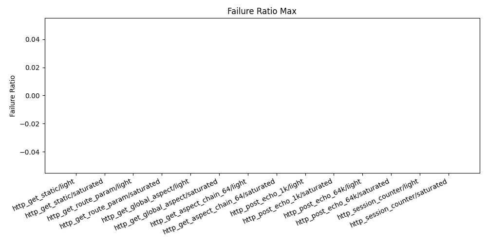

# Benchmark Report

## Executive Summary

- total_cells: `14`
- stable_cells: `13`
- unstable_cells: `1`
- best_throughput: `http_get_static/saturated` at `169860.64 rps`
- lowest_p95: `http_get_static/light` at `23.61 us`
- highest_p95: `http_session_counter/saturated` at `7656.91 us`

## Validation Scope

- source_revision: `8cf0d86`
- benchmark_target:
  `route parameter naming rewrite + mountable BluePrint support + benchmark automation scripts`
- benchmark_command: `bash scripts/benchmark.sh`
- validated_tests:
  `unit_blue_print_test`, `unit_route_table_test`, `unit_http_server_task_test`,
  `stress_route_table_test`, `stress_keep_alive_route_param_test`
- script_checks:
  `bash -n scripts/build.sh scripts/format.sh scripts/benchmark.sh`,
  `python3 -m py_compile scripts/benchmark_plot.py`

## Reproduction

Run the canonical report workflow:

```bash
bash scripts/benchmark.sh
```

Run the benchmark binary directly with the same parameters used by this report:

```bash
./build-bench/benchmarks/bsrvcore_http_benchmark \
  --scenario all \
  --profile quick \
  --client-processes 4 \
  --wrk-threads-per-process 1 \
  --wrk-bin ./build-bench/_deps/bsrvcore_benchmark_wrk/src/bsrvcore_benchmark_wrk/wrk \
  --output-json docs/benchmark-results/benchmark-report.json
```

## Environment

- timestamp_utc: `2026-03-25T18:43:51Z`
- os: `Linux 6.19.8-200.fc43.x86_64 x86_64`
- compiler: `GNU 15.2.1`
- build_type: `Release`
- logical_cpu_count: `20`

## Run Config

- scenario: `all`
- profile: `quick`
- pressure: `profile-default`
- warmup_ms: `1000`
- duration_ms: `3000`
- cooldown_ms: `500`
- client_processes: `4`
- wrk_threads_per_process: `1`
- repetitions: `2`
- wrk_bin: `/home/haomingbai/my_projects/bsrvcore/build-bench/_deps/bsrvcore_benchmark_wrk/src/bsrvcore_benchmark_wrk/wrk`

## Artifacts

- raw_json: [benchmark-report.json](benchmark-report.json)
- markdown_report: [benchmark-report.md](benchmark-report.md)
- throughput_plot: [benchmark-report-rps.png](benchmark-report-rps.png)
- latency_plot: [benchmark-report-latency.png](benchmark-report-latency.png)
- failure_plot: [benchmark-report-failure.png](benchmark-report-failure.png)

## Change-Focused Findings

- Named route parameters remain close to the static route baseline under load.
  `http_get_route_param/light` is `4.33%` below `http_get_static/light` in mean
  RPS, while `http_get_route_param/saturated` is only `0.69%` below the
  saturated static route.
- The new parameter naming logic does not introduce a visible saturated-path
  latency regression. Static vs route-param p95 is `1053.81 us` vs `1060.95 us`,
  which is effectively flat for this sweep.
- A single global aspect adds modest light-load overhead. Relative to
  `http_get_route_param/light`, `http_get_global_aspect/light` drops mean RPS by
  `3.84%`. Under saturated load the difference is within noise, with the global
  aspect path slightly higher in this run.
- Deep aspect chains are cheap under saturation but still visible on the light
  path. `http_get_aspect_chain_64/light` is `33.79%` below
  `http_get_global_aspect/light`, while `http_get_aspect_chain_64/saturated` is
  only `2.51%` lower than `http_get_global_aspect/saturated`.
- Payload size is not the throughput limiter in this quick sweep for the echo
  benchmark. `http_post_echo_64k` and `http_post_echo_1k` deliver nearly the
  same RPS in both pressure levels, but the 64 KiB case pushes much higher
  bandwidth.
- `http_session_counter/saturated` is the main latency outlier. Throughput stays
  high at `165989.68 rps`, but p95 reaches `7656.91 us` and p99 reaches
  `13002.44 us`, far above the other GET paths. That is the main follow-up item
  if latency tail reduction matters.
- The only unstable cell is `http_get_static/light`. The trigger is latency
  variance rather than throughput loss: `rps_cv` is `0.030`, but `p95_cv` is
  `0.186`, above the `0.150` stability threshold.

## Stability Rule

A cell is marked `stable` only when all conditions are met:

- `rps_cv <= 10%`
- `p95_cv <= 15%`
- `failure_ratio.max <= 5%`
- `loadgen_failure_count.max == 0`

## Cell Configuration

| scenario | pressure | client_concurrency | server_io_threads | server_worker_threads | warmup_ms | duration_ms | cooldown_ms | repetitions |
| --- | --- | --- | --- | --- | --- | --- | --- | --- |
| http_get_static | light | 1 | 1 | 1 | 1000 | 3000 | 500 | 2 |
| http_get_static | saturated | 160 | 10 | 20 | 1000 | 3000 | 500 | 2 |
| http_get_route_param | light | 1 | 1 | 1 | 1000 | 3000 | 500 | 2 |
| http_get_route_param | saturated | 160 | 10 | 20 | 1000 | 3000 | 500 | 2 |
| http_get_global_aspect | light | 1 | 1 | 1 | 1000 | 3000 | 500 | 2 |
| http_get_global_aspect | saturated | 160 | 10 | 20 | 1000 | 3000 | 500 | 2 |
| http_get_aspect_chain_64 | light | 1 | 1 | 1 | 1000 | 3000 | 500 | 2 |
| http_get_aspect_chain_64 | saturated | 160 | 10 | 20 | 1000 | 3000 | 500 | 2 |
| http_post_echo_1k | light | 1 | 1 | 1 | 1000 | 3000 | 500 | 2 |
| http_post_echo_1k | saturated | 160 | 10 | 20 | 1000 | 3000 | 500 | 2 |
| http_post_echo_64k | light | 1 | 1 | 1 | 1000 | 3000 | 500 | 2 |
| http_post_echo_64k | saturated | 160 | 10 | 20 | 1000 | 3000 | 500 | 2 |
| http_session_counter | light | 1 | 1 | 1 | 1000 | 3000 | 500 | 2 |
| http_session_counter | saturated | 160 | 10 | 20 | 1000 | 3000 | 500 | 2 |

## Scenario Summary

| scenario | pressure | mean_rps | rps_cv | p50_us | p95_us | p99_us | max_us | failure_ratio_max | stability |
| --- | --- | --- | --- | --- | --- | --- | --- | --- | --- |
| http_get_static | light | 70188.07 | 0.030 | 13.00 | 23.61 | 28.50 | 1298.00 | 0.0000 | unstable |
| http_get_static | saturated | 169860.64 | 0.002 | 938.64 | 1053.81 | 1124.85 | 14870.00 | 0.0000 | stable |
| http_get_route_param | light | 67146.45 | 0.013 | 13.00 | 51.33 | 78.00 | 1218.50 | 0.0000 | stable |
| http_get_route_param | saturated | 168686.03 | 0.011 | 948.64 | 1060.95 | 1133.70 | 14720.00 | 0.0000 | stable |
| http_get_global_aspect | light | 64570.97 | 0.004 | 13.00 | 50.50 | 76.50 | 327.00 | 0.0000 | stable |
| http_get_global_aspect | saturated | 169518.55 | 0.000 | 940.00 | 1053.28 | 1124.99 | 15480.00 | 0.0000 | stable |
| http_get_aspect_chain_64 | light | 42755.16 | 0.015 | 21.00 | 45.44 | 61.00 | 329.50 | 0.0000 | stable |
| http_get_aspect_chain_64 | saturated | 165265.67 | 0.006 | 965.00 | 1089.03 | 1161.25 | 13255.00 | 0.0000 | stable |
| http_post_echo_1k | light | 15315.65 | 0.003 | 14.00 | 96.28 | 154.50 | 356.00 | 0.0000 | stable |
| http_post_echo_1k | saturated | 86867.83 | 0.001 | 1150.12 | 1877.81 | 1989.99 | 3875.00 | 0.0000 | stable |
| http_post_echo_64k | light | 15317.74 | 0.004 | 14.00 | 99.28 | 157.50 | 403.00 | 0.0000 | stable |
| http_post_echo_64k | saturated | 87109.67 | 0.003 | 1066.23 | 1841.53 | 1968.74 | 4835.00 | 0.0000 | stable |
| http_session_counter | light | 62212.42 | 0.012 | 14.00 | 84.22 | 136.00 | 12825.00 | 0.0000 | stable |
| http_session_counter | saturated | 165989.68 | 0.000 | 940.00 | 7656.91 | 13002.44 | 35675.00 | 0.0000 | stable |

## Detailed Results

### http_get_static/light

- load_shape: `client_concurrency=1`, `server_io_threads=1`, `server_worker_threads=1`
- throughput: mean `70188.07 rps`, min `68095.48`, max `72280.65`, cv `0.030`
- latency: p50 `13.00 us`, p95 `23.61 us`, p99 `28.50 us`, max `1298.00 us`
- success_path: mean_success `217583.00`, mean_errors `0.00`, failure_ratio_max `0.0000`
- bandwidth: mean `12.316 MiB/s`, bytes_sent_mean `18712138.00`, bytes_received_mean `21322792.50`
- stability: `unstable`

| repetition | rps | p50_us | p95_us | p99_us | max_us | failure_ratio | success_count | error_count |
| --- | --- | --- | --- | --- | --- | --- | --- | --- |
| 1 | 68095.48 | 13.00 | 28.00 | 36.00 | 426.00 | 0.0000 | 211096 | 0 |
| 2 | 72280.65 | 13.00 | 19.22 | 21.00 | 2170.00 | 0.0000 | 224070 | 0 |

### http_get_static/saturated

- load_shape: `client_concurrency=160`, `server_io_threads=10`, `server_worker_threads=20`
- throughput: mean `169860.64 rps`, min `169520.97`, max `170200.32`, cv `0.002`
- latency: p50 `938.64 us`, p95 `1053.81 us`, p99 `1124.85 us`, max `14870.00 us`
- success_path: mean_success `526568.00`, mean_errors `0.00`, failure_ratio_max `0.0000`
- bandwidth: mean `29.809 MiB/s`, bytes_sent_mean `45284848.00`, bytes_received_mean `51610910.50`
- stability: `stable`

| repetition | rps | p50_us | p95_us | p99_us | max_us | failure_ratio | success_count | error_count |
| --- | --- | --- | --- | --- | --- | --- | --- | --- |
| 1 | 169520.97 | 940.00 | 1060.23 | 1132.42 | 15740.00 | 0.0000 | 525515 | 0 |
| 2 | 170200.32 | 937.28 | 1047.38 | 1117.28 | 14000.00 | 0.0000 | 527621 | 0 |

### http_get_route_param/light

- load_shape: `client_concurrency=1`, `server_io_threads=1`, `server_worker_threads=1`
- throughput: mean `67146.45 rps`, min `66300.00`, max `67992.90`, cv `0.013`
- latency: p50 `13.00 us`, p95 `51.33 us`, p99 `78.00 us`, max `1218.50 us`
- success_path: mean_success `208154.00`, mean_errors `0.00`, failure_ratio_max `0.0000`
- bandwidth: mean `12.167 MiB/s`, bytes_sent_mean `19150168.00`, bytes_received_mean `20400046.00`
- stability: `stable`

| repetition | rps | p50_us | p95_us | p99_us | max_us | failure_ratio | success_count | error_count |
| --- | --- | --- | --- | --- | --- | --- | --- | --- |
| 1 | 66300.00 | 13.00 | 52.44 | 80.00 | 297.00 | 0.0000 | 205530 | 0 |
| 2 | 67992.90 | 13.00 | 50.22 | 76.00 | 2140.00 | 0.0000 | 210778 | 0 |

### http_get_route_param/saturated

- load_shape: `client_concurrency=160`, `server_io_threads=10`, `server_worker_threads=20`
- throughput: mean `168686.03 rps`, min `166898.07`, max `170474.00`, cv `0.011`
- latency: p50 `948.64 us`, p95 `1060.95 us`, p99 `1133.70 us`, max `14720.00 us`
- success_path: mean_success `514403.00`, mean_errors `0.00`, failure_ratio_max `0.0000`
- bandwidth: mean `30.564 MiB/s`, bytes_sent_mean `47325076.00`, bytes_received_mean `50405048.50`
- stability: `stable`

| repetition | rps | p50_us | p95_us | p99_us | max_us | failure_ratio | success_count | error_count |
| --- | --- | --- | --- | --- | --- | --- | --- | --- |
| 1 | 170474.00 | 940.00 | 1051.66 | 1124.99 | 15530.00 | 0.0000 | 511422 | 0 |
| 2 | 166898.07 | 957.27 | 1070.23 | 1142.42 | 13910.00 | 0.0000 | 517384 | 0 |

### http_get_global_aspect/light

- load_shape: `client_concurrency=1`, `server_io_threads=1`, `server_worker_threads=1`
- throughput: mean `64570.97 rps`, min `64291.29`, max `64850.64`, cv `0.004`
- latency: p50 `13.00 us`, p95 `50.50 us`, p99 `76.50 us`, max `327.00 us`
- success_path: mean_success `200170.00`, mean_errors `0.00`, failure_ratio_max `0.0000`
- bandwidth: mean `14.225 MiB/s`, bytes_sent_mean `17214620.00`, bytes_received_mean `29024584.00`
- stability: `stable`

| repetition | rps | p50_us | p95_us | p99_us | max_us | failure_ratio | success_count | error_count |
| --- | --- | --- | --- | --- | --- | --- | --- | --- |
| 1 | 64291.29 | 13.00 | 51.89 | 79.00 | 331.00 | 0.0000 | 199303 | 0 |
| 2 | 64850.64 | 13.00 | 49.11 | 74.00 | 323.00 | 0.0000 | 201037 | 0 |

### http_get_global_aspect/saturated

- load_shape: `client_concurrency=160`, `server_io_threads=10`, `server_worker_threads=20`
- throughput: mean `169518.55 rps`, min `169490.97`, max `169546.13`, cv `0.000`
- latency: p50 `940.00 us`, p95 `1053.28 us`, p99 `1124.99 us`, max `15480.00 us`
- success_path: mean_success `525507.50`, mean_errors `0.00`, failure_ratio_max `0.0000`
- bandwidth: mean `37.344 MiB/s`, bytes_sent_mean `45193645.00`, bytes_received_mean `76194774.50`
- stability: `stable`

| repetition | rps | p50_us | p95_us | p99_us | max_us | failure_ratio | success_count | error_count |
| --- | --- | --- | --- | --- | --- | --- | --- | --- |
| 1 | 169490.97 | 940.00 | 1051.74 | 1125.13 | 15910.00 | 0.0000 | 525422 | 0 |
| 2 | 169546.13 | 940.00 | 1054.82 | 1124.85 | 15050.00 | 0.0000 | 525593 | 0 |

### http_get_aspect_chain_64/light

- load_shape: `client_concurrency=1`, `server_io_threads=1`, `server_worker_threads=1`
- throughput: mean `42755.16 rps`, min `42101.61`, max `43408.71`, cv `0.015`
- latency: p50 `21.00 us`, p95 `45.44 us`, p99 `61.00 us`, max `329.50 us`
- success_path: mean_success `132541.00`, mean_errors `0.00`, failure_ratio_max `0.0000`
- bandwidth: mean `9.868 MiB/s`, bytes_sent_mean `11398526.00`, bytes_received_mean `20677919.00`
- stability: `stable`

| repetition | rps | p50_us | p95_us | p99_us | max_us | failure_ratio | success_count | error_count |
| --- | --- | --- | --- | --- | --- | --- | --- | --- |
| 1 | 43408.71 | 21.00 | 39.89 | 51.00 | 328.00 | 0.0000 | 134567 | 0 |
| 2 | 42101.61 | 21.00 | 51.00 | 71.00 | 331.00 | 0.0000 | 130515 | 0 |

### http_get_aspect_chain_64/saturated

- load_shape: `client_concurrency=160`, `server_io_threads=10`, `server_worker_threads=20`
- throughput: mean `165265.67 rps`, min `164241.67`, max `166289.67`, cv `0.006`
- latency: p50 `965.00 us`, p95 `1089.03 us`, p99 `1161.25 us`, max `13255.00 us`
- success_path: mean_success `495797.00`, mean_errors `0.00`, failure_ratio_max `0.0000`
- bandwidth: mean `38.143 MiB/s`, bytes_sent_mean `42638542.00`, bytes_received_mean `77348208.00`
- stability: `stable`

| repetition | rps | p50_us | p95_us | p99_us | max_us | failure_ratio | success_count | error_count |
| --- | --- | --- | --- | --- | --- | --- | --- | --- |
| 1 | 166289.67 | 960.00 | 1080.28 | 1152.50 | 11680.00 | 0.0000 | 498869 | 0 |
| 2 | 164241.67 | 970.00 | 1097.78 | 1170.00 | 14830.00 | 0.0000 | 492725 | 0 |

### http_post_echo_1k/light

- load_shape: `client_concurrency=1`, `server_io_threads=1`, `server_worker_threads=1`
- throughput: mean `15315.65 rps`, min `15275.16`, max `15356.13`, cv `0.003`
- latency: p50 `14.00 us`, p95 `96.28 us`, p99 `154.50 us`, max `356.00 us`
- success_path: mean_success `47478.50`, mean_errors `0.00`, failure_ratio_max `0.0000`
- bandwidth: mean `19.046 MiB/s`, bytes_sent_mean `55027581.50`, bytes_received_mean `6883901.50`
- stability: `stable`

| repetition | rps | p50_us | p95_us | p99_us | max_us | failure_ratio | success_count | error_count |
| --- | --- | --- | --- | --- | --- | --- | --- | --- |
| 1 | 15356.13 | 14.00 | 93.56 | 154.00 | 330.00 | 0.0000 | 47604 | 0 |
| 2 | 15275.16 | 14.00 | 99.00 | 155.00 | 382.00 | 0.0000 | 47353 | 0 |

### http_post_echo_1k/saturated

- load_shape: `client_concurrency=160`, `server_io_threads=10`, `server_worker_threads=20`
- throughput: mean `86867.83 rps`, min `86747.33`, max `86988.33`, cv `0.001`
- latency: p50 `1150.12 us`, p95 `1877.81 us`, p99 `1989.99 us`, max `3875.00 us`
- success_path: mean_success `260603.50`, mean_errors `0.00`, failure_ratio_max `0.0000`
- bandwidth: mean `108.026 MiB/s`, bytes_sent_mean `302039456.50`, bytes_received_mean `37780193.00`
- stability: `stable`

| repetition | rps | p50_us | p95_us | p99_us | max_us | failure_ratio | success_count | error_count |
| --- | --- | --- | --- | --- | --- | --- | --- | --- |
| 1 | 86747.33 | 1195.15 | 1891.99 | 2007.52 | 3080.00 | 0.0000 | 260242 | 0 |
| 2 | 86988.33 | 1105.10 | 1863.63 | 1972.47 | 4670.00 | 0.0000 | 260965 | 0 |

### http_post_echo_64k/light

- load_shape: `client_concurrency=1`, `server_io_threads=1`, `server_worker_threads=1`
- throughput: mean `15317.74 rps`, min `15262.26`, max `15373.23`, cv `0.004`
- latency: p50 `14.00 us`, p95 `99.28 us`, p99 `157.50 us`, max `403.00 us`
- success_path: mean_success `47485.00`, mean_errors `0.00`, failure_ratio_max `0.0000`
- bandwidth: mean `961.463 MiB/s`, bytes_sent_mean `3118434920.00`, bytes_received_mean `6883901.50`
- stability: `stable`

| repetition | rps | p50_us | p95_us | p99_us | max_us | failure_ratio | success_count | error_count |
| --- | --- | --- | --- | --- | --- | --- | --- | --- |
| 1 | 15373.23 | 14.00 | 99.89 | 159.00 | 464.00 | 0.0000 | 47657 | 0 |
| 2 | 15262.26 | 14.00 | 98.67 | 156.00 | 342.00 | 0.0000 | 47313 | 0 |

### http_post_echo_64k/saturated

- load_shape: `client_concurrency=160`, `server_io_threads=10`, `server_worker_threads=20`
- throughput: mean `87109.67 rps`, min `86840.33`, max `87379.00`, cv `0.003`
- latency: p50 `1066.23 us`, p95 `1841.53 us`, p99 `1968.74 us`, max `4835.00 us`
- success_path: mean_success `261329.00`, mean_errors `0.00`, failure_ratio_max `0.0000`
- bandwidth: mean `5467.697 MiB/s`, bytes_sent_mean `17161998088.00`, bytes_received_mean `37890294.00`
- stability: `stable`

| repetition | rps | p50_us | p95_us | p99_us | max_us | failure_ratio | success_count | error_count |
| --- | --- | --- | --- | --- | --- | --- | --- | --- |
| 1 | 87379.00 | 1107.47 | 1835.56 | 1959.98 | 5390.00 | 0.0000 | 262137 | 0 |
| 2 | 86840.33 | 1024.99 | 1847.50 | 1977.50 | 4280.00 | 0.0000 | 260521 | 0 |

### http_session_counter/light

- load_shape: `client_concurrency=1`, `server_io_threads=1`, `server_worker_threads=1`
- throughput: mean `62212.42 rps`, min `61454.84`, max `62970.00`, cv `0.012`
- latency: p50 `14.00 us`, p95 `84.22 us`, p99 `136.00 us`, max `12825.00 us`
- success_path: mean_success `192858.50`, mean_errors `0.00`, failure_ratio_max `0.0000`
- bandwidth: mean `14.477 MiB/s`, bytes_sent_mean `17164406.50`, bytes_received_mean `29894901.50`
- stability: `stable`

| repetition | rps | p50_us | p95_us | p99_us | max_us | failure_ratio | success_count | error_count |
| --- | --- | --- | --- | --- | --- | --- | --- | --- |
| 1 | 62970.00 | 14.00 | 85.11 | 138.00 | 12630.00 | 0.0000 | 195207 | 0 |
| 2 | 61454.84 | 14.00 | 83.33 | 134.00 | 13020.00 | 0.0000 | 190510 | 0 |

### http_session_counter/saturated

- load_shape: `client_concurrency=160`, `server_io_threads=10`, `server_worker_threads=20`
- throughput: mean `165989.68 rps`, min `165987.10`, max `165992.26`, cv `0.000`
- latency: p50 `940.00 us`, p95 `7656.91 us`, p99 `13002.44 us`, max `35675.00 us`
- success_path: mean_success `514568.00`, mean_errors `0.00`, failure_ratio_max `0.0000`
- bandwidth: mean `38.624 MiB/s`, bytes_sent_mean `45796552.00`, bytes_received_mean `79754690.00`
- stability: `stable`

| repetition | rps | p50_us | p95_us | p99_us | max_us | failure_ratio | success_count | error_count |
| --- | --- | --- | --- | --- | --- | --- | --- | --- |
| 1 | 165992.26 | 940.00 | 7689.95 | 13057.91 | 35590.00 | 0.0000 | 514576 | 0 |
| 2 | 165987.10 | 940.00 | 7623.87 | 12946.97 | 35760.00 | 0.0000 | 514560 | 0 |

## Plots





