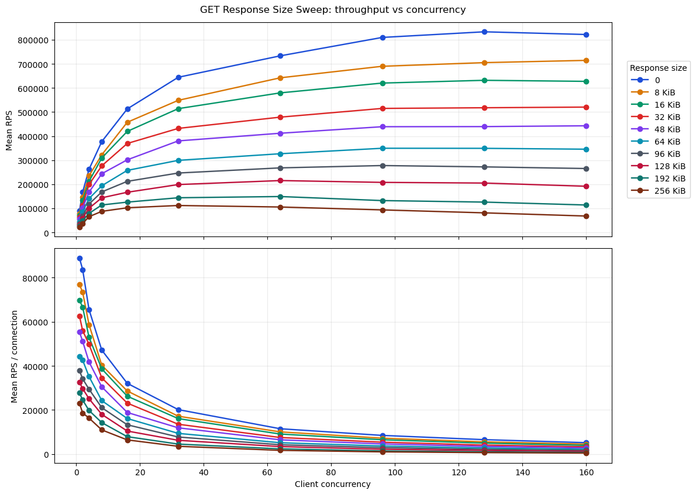
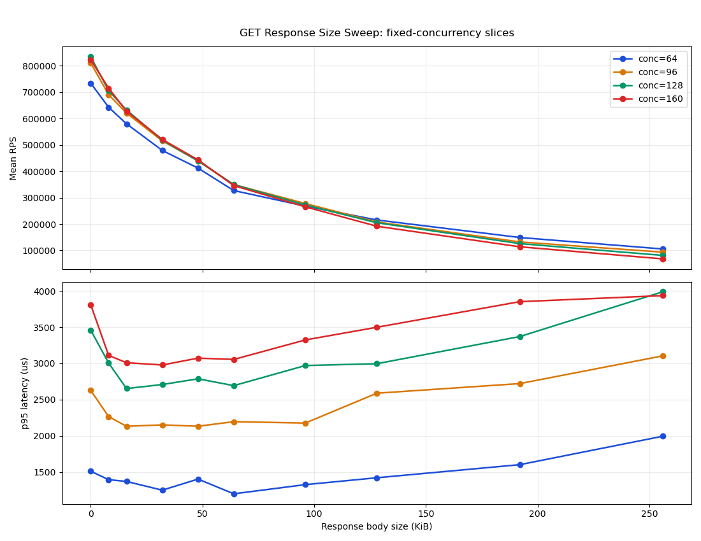
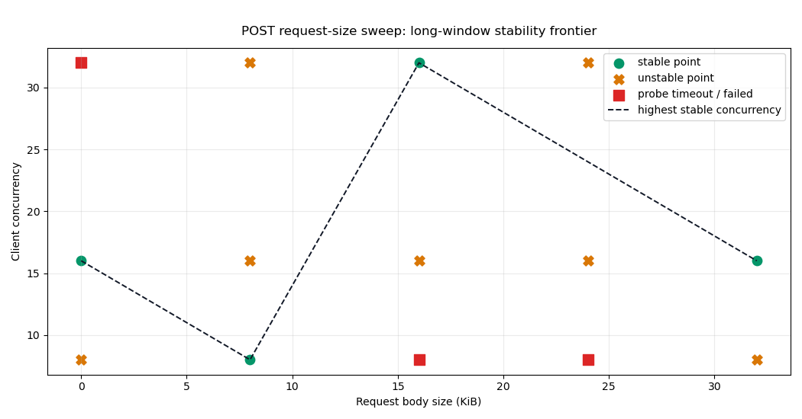
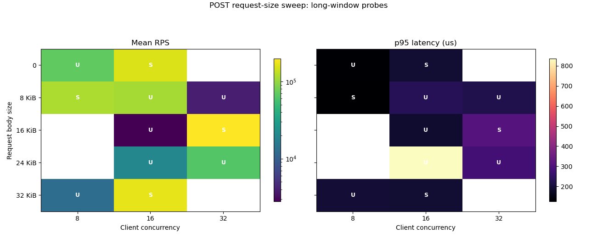
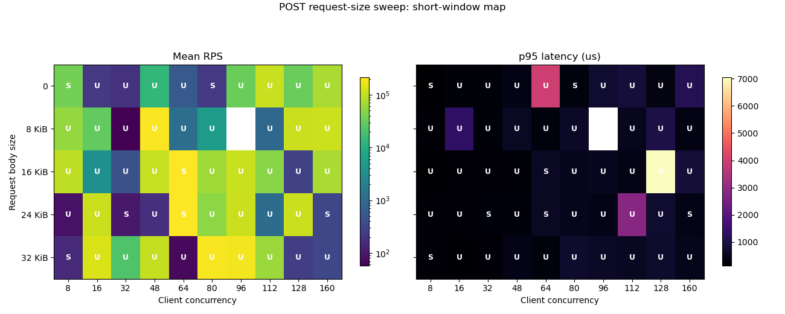

# Bsrvcore Main-Branch HTTP Benchmark Report (2026-04-12 Refresh)

## 1. Current Outcome

This refresh followed the requested sequence:

1. Re-run the previous report winner once for a quick sanity check, but do not count it as a formal result.
2. Run a coarse mainline scan.
3. Refine around the coarse peak with longer runs.
4. Add body-size experiments for per-connection throughput and request/response-size sensitivity.

The previous report winner peek was:

- `io20-worker4-conc160-proc3-wrk2`
- `854348.07 rps`
- `p95 3040.34 us`, `p99 4492.54 us`

That point was only a reference. The formal winner for this refresh is:

- `io18-worker1-conc160-proc4-wrk2`
- `861148.07 rps`
- `per-connection throughput = 5382.18 rps`
- `p95 3171.76 us`, `p99 4419.79 us`
- stability: `stable`

Two comparisons matter:

- versus the old winner peek: `+0.80%`
- versus the first coarse-only winner: `+49.62%`

That combination says the machine state was consistent, but the first coarse pass was still loadgen-limited and needed targeted refinement.

## 2. Coarse To Fine Scan Path

The mainline scan separated exploration from confirmation instead of trusting the first local peak.

Coarse-only pass (`55` cells, `1500/5000/800 ms x3`) found:

- winner: `io10-worker20-conc160-proc2-wrk1`
- `575572.24 rps`
- `p95 427.80 us`

That was a useful seed, but it clearly under-drove the server. The first targeted fine pass kept the server near the coarse peak and widened the loadgen shape:

- best stable phase-1 point: `io20-worker4-conc160-proc4-wrk2`
- `831786.47 rps`
- `p95 3014.63 us`

So loadgen refinement alone added about `44.51%` over the coarse-only winner.

The second fine pass locked `proc=4 wrk=2`, then scanned the thread neighborhood around the emerging peak:

- best phase-2 point: `io18-worker1-conc160-proc4-wrk2`
- `891785.90 rps`
- `p95 3098.38 us`

The third pass varied concurrency around that neighborhood:

- best phase-3 point: `io18-worker1-conc136-proc4-wrk2`
- `864880.80 rps`
- `p95 2878.13 us`

That looked slightly better in the shorter window, so the last step was a true long confirmation (`2000/12000/1000 ms x5`) on the top candidates:

- final winner: `io18-worker1-conc160-proc4-wrk2`, `861148.07 rps`
- runner-up: `io19-worker1-conc160-proc4-wrk2`, `860741.37 rps`
- gap between them: only `0.05%`

In other words, the winner is real, but it sits on a narrow plateau rather than on an isolated spike.

## 3. Mainline Interpretation

Three mainline conclusions survived the longer confirmation pass.

- `proc=4 wrk=2` was necessary to expose the real server-side plateau. The coarse quick pass left too much performance on the table.
- The best region is not `io20 + worker4` any more. It moved toward `io18-19 + worker1`, with `conc=160` winning the long run.
- The winner and runner-up are nearly tied on throughput, so there is room to trade a little throughput for slightly better tails.

A useful latency-tilted counterpoint from the confirmation set is:

- `io18-worker1-conc136-proc4-wrk2`
- `834857.23 rps`
- `p95 2848.32 us`

Relative to the winner, that is:

- throughput: `-3.05%`
- p95 latency: `-10.20%`

So the current result set does not show a dramatic "free lunch" operating point. The tradeoff is modest but real: a small throughput concession buys a noticeable p95 improvement.

## 4. GET Response-Body Sweep

The GET body experiment fixed the server at the formal winner threads (`io=18`, `worker=1`) and swept:

- `client_concurrency = 1..160`
- `response_body_bytes = 0..256 KiB`
- `request_body_bytes = 0`
- timing: `1500/5000/800 ms x3`

At fixed `conc=160`, the response-size curve was smooth and stable:

| response body | mean_rps | vs 0B | per_conn_rps | p95_us |
| --- | ---: | ---: | ---: | ---: |
| `0` | 821970.97 | `0.00%` | 5137.32 | 3808.53 |
| `8 KiB` | 714503.66 | `-13.07%` | 4465.65 | 3110.11 |
| `16 KiB` | 627347.32 | `-23.68%` | 3920.92 | 3009.10 |
| `32 KiB` | 520477.42 | `-36.68%` | 3252.98 | 2978.21 |
| `64 KiB` | 345595.95 | `-57.96%` | 2159.97 | 3054.43 |
| `128 KiB` | 191727.96 | `-76.67%` | 1198.30 | 3498.70 |
| `256 KiB` | 68013.15 | `-91.73%` | 425.08 | 3935.99 |

This curve is the easy one to reason about:

- total throughput falls roughly continuously as response size grows
- per-connection throughput also falls continuously
- p95 moves only from about `3.0 ms` to about `3.9 ms`
- no timeout cliff appeared, even at `256 KiB`

So GET response-heavy traffic looks bandwidth-dominated, not collapse-dominated. The likely explanation is ordinary copy, buffering, and socket-bandwidth pressure, not an abrupt runtime mode switch.

## 5. POST Request-Body Sweep

POST request bodies behaved very differently. A single long full-grid run was not trustworthy, because early probes already showed hard failures at larger sizes:

- `64 KiB @ conc=64` timed out
- `96 KiB @ conc=32` timed out

That forced the formal POST work into three layers:

1. Long-window frontier probes: `1500/5000/800 ms x3`
2. Short-window map over a wider grid: `1000/3000/500 ms x2`
3. Long-window confirmation on representative islands: `2000/8000/1000 ms x4`

### 5.1 Long-window frontier

The long-window frontier already showed that the POST curve was not monotonic.

Stable points existed at:

- `conc=8, req=8 KiB`: `117453.07 rps`
- `conc=16, req=0`: `156563.01 rps`
- `conc=16, req=32 KiB`: `167173.27 rps`
- `conc=32, req=16 KiB`: `197401.44 rps`

But nearby points could collapse or fail:

- `conc=16, req=16 KiB`: `2777.36 rps`
- `conc=32, req=8 KiB`: `3969.66 rps`
- `conc=8, req=16 KiB`: timeout
- `conc=8, req=24 KiB`: timeout
- `conc=32, req=0`: timeout

So the long-window frontier already ruled out any simple "body gets larger, throughput just goes down" model.

### 5.2 Short-window map

The wider short-window map covered `49` completed cells plus one recorded failure (`conc=96, req=8 KiB`).

The strongest stable islands in that wider map were:

- `conc=64, req=16 KiB`: `212812.42 rps`
- `conc=64, req=24 KiB`: `210160.65 rps`

But adjacent cells could be drastically worse:

- `conc=64, req=8 KiB`: `1110.80 rps`
- `conc=64, req=32 KiB`: `68.94 rps`

That is a multi-order-of-magnitude jump inside one local neighborhood. The short-window map therefore describes shape, but not by itself reproducibility.

### 5.3 Long-window confirmation of the islands

To separate real platforms from short-lived spikes, four representative islands were rerun with longer timing.

| point | short-window result | long-window confirm | outcome |
| --- | --- | --- | --- |
| `conc=64, req=16 KiB` | `212812.42 rps`, stable | `207204.91 rps`, stable | real stable platform |
| `conc=64, req=24 KiB` | `210160.65 rps`, stable | `200045.34 rps`, stable | real stable platform |
| `conc=48, req=8 KiB` | `205644.52 rps`, unstable | `88938.87 rps`, unstable | short-window spike, not reproducible |
| `conc=80, req=32 KiB` | `195283.55 rps`, unstable | `212660.22 rps`, stable | real platform, short run misclassified |

This is the most important POST conclusion:

- POST request-body throughput is organized around discrete stable platforms
- those platforms are separated by large unstable regions
- some short-window highs vanish under longer timing
- some short-window highs survive and become fully stable under longer timing

That is why the report uses both short-window and long-window views instead of collapsing everything into one heatmap.

The likely causes are in request-body ingest, buffering thresholds, scheduling, or loadgen pacing. What the data does **not** support is a simple queueing-collapse story, because many low-throughput cells still have sub-millisecond or low-millisecond p95. To prove root cause, the next step would be code-level instrumentation around body read, parse, and writeback phases.

## 6. Environment And Scope

- CPU: `13th Gen Intel(R) Core(TM) i9-13900H`
- logical CPUs: `20`
- OS: `Fedora Linux 43 (Workstation Edition)`
- kernel: `6.19.11-200.fc43.x86_64`
- topology: single-host loopback
- build: `Release`

The final report intentionally omits hostname, IP addresses, and raw `uname -a` output.

## 7. Artifact Index

Published report artifacts:

- summary manifest: `benchmark-report.json`
- package summary: `package/summary.md`
- sanitized environment snapshot: `package/client-env.json`

Raw benchmark sources remain under `.artifacts/benchmark-results/`:

- `winner-peek-20260412`
- `mainline-coarse-20260412`
- `mainline-fine-20260412`
- `mainline-final-20260412`
- `body-get-curves-20260412`
- `body-post-probes-20260412`
- `body-post-short-map-20260412`
- `body-post-long-confirm-20260412`
