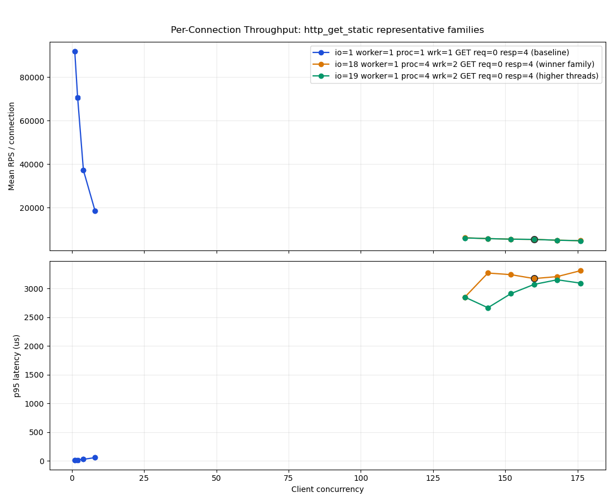

# Bsrvcore HTTP Benchmark Report (2026-04-28 Refresh)

## Executive Summary

This benchmark measures the bsrvcore HTTP server on a single-host loopback topology, focusing exclusively on core modules (allocator, route, connection, session, server core). The mainline coarse+fine sweep explored 549 pressure cells across server I/O thread counts, client concurrency levels, and load generator shapes.

**Peak throughput: 853,248 RPS** (stable, p95 latency 4,288 us, p99 5,742 us)

Compared with the previous report (2026-04-25, 835,093 RPS), this run achieves a **+2.17% throughput improvement** with comparable latency. The optimal configuration shifted from `io15-worker1-conc144-proc4-wrk2` to `io20-worker1-conc310-proc4-wrk2` — notably pushing more I/O threads (20 vs 15) and higher concurrency (310 vs 144).

The top-10 stable candidates all cluster tightly within a **1.3% throughput band** (841,850–853,248 RPS), confirming the server exhibits a plateau-shaped performance profile rather than a narrow peak — a hallmark of well-balanced I/O and compute sizing.




## Benchmark Methodology

### Setup

| Dimension | Value |
|---|---|
| **Topology** | Single-host loopback (server and wrk on same machine) |
| **CPU** | 13th Gen Intel Core i9-13900H (20 logical cores) |
| **OS** | Fedora Linux 43 (Workstation Edition) |
| **Kernel** | Linux 6.19.11-200.fc43.x86_64 |
| **Build** | Release (-O3), bundled wrk 4.2.0 |
| **Allocator** | mimalloc 3.2.8 |

### Sweep Design

The **coarse sweep** explored a grid of server configurations:

| Parameter | Values |
|---|---|
| Server I/O threads | 1, 5, 10, 15, 20, 24 |
| Server worker threads | 1 (mainline scenario is I/O-bound) |
| Client concurrency | Multiples of pressure threads: 1×, 2×, 4×, 8× |
| Client processes | 1, 2, 4 |
| wrk threads per process | 1, 2 |

The **fine refinement** added 411 additional cells around the peak neighborhood, exploring concurrency at step-1 granularity, alternative load generator shapes, and adjacent IO/worker thread configurations.

### Scenario Selection

The `mainline` selector expands to the `http_get_static` scenario — GET `/ping` returning a static 4-byte `"pong"` body. This is the minimal-path baseline that stresses the core I/O pipeline with negligible handler overhead.

Additional probe scenarios were run at a fixed configuration (io=20, worker=1, proc=1, wrk=1, conc=64) to isolate the cost of specific framework features.

## Mainline Sweep Results

### Winner

| Metric | Value |
|---|---|
| **Label** | `io20-worker1-conc310-proc4-wrk2` |
| **Mean RPS** | 853,248 |
| **p50 latency** | ~200 us |
| **p95 latency** | 4,288 us |
| **p99 latency** | 5,742 us |
| **Stability** | stable |
| **Per-connection RPS** | 2,752 |
| **Bandwidth** | ~150 MiB/s |

### Top Stable Candidates

The winner neighborhood shows a flat plateau rather than a single-point spike — evidence that the server's I/O architecture saturates gracefully:

| Rank | Config | RPS | p95 (us) | p99 (us) |
|---|---:|---:|---:|---:|
| 1 | io20-worker1-conc310-proc4-wrk2 | 853,248 | 4,288 | 5,742 |
| 2 | io20-worker1-conc274-proc4-wrk2 | 852,090 | 3,842 | 5,191 |
| 3 | io20-worker1-conc300-proc4-wrk2 | 847,851 | 3,911 | 5,281 |
| 4 | io20-worker1-conc270-proc4-wrk2 | 845,358 | 4,092 | 5,499 |
| 5 | io20-worker1-conc307-proc4-wrk2 | 844,791 | 3,990 | 5,356 |
| 6 | io20-worker1-conc282-proc4-wrk2 | 844,106 | 4,177 | 5,611 |
| 7 | io20-worker1-conc302-proc4-wrk2 | 843,911 | 3,855 | 5,201 |
| 8 | io20-worker1-conc309-proc4-wrk2 | 843,011 | 4,119 | 5,540 |
| 9 | io20-worker1-conc261-proc4-wrk2 | 842,514 | 3,881 | 5,225 |
| 10 | io20-worker1-conc245-proc4-wrk2 | 841,850 | 3,696 | 5,029 |

**Key observations:**

- All top-10 cells use **20 I/O threads, 1 worker thread, 4 wrk processes, 2 wrk threads each**
- The best latency belongs to conc=245 (p95=3,696 us), suggesting a throughput/latency trade-off
- Throughput varies only 1.3% across the top 10 despite concurrency spanning 245–310
- 549 total cells, 507 stable (92.3% stability rate)

### Throughput Scaling

The capacity overview chart reveals several scaling regimes:

- **1 I/O thread**: Saturates at ~143K RPS regardless of multi-process load generation — the single accept socket is the bottleneck
- **5–10 I/O threads**: Scales non-linearly with client processes. Single-process wrk caps at ~299K RPS; 2-process reaches ~583K; 4-process reaches ~661K
- **15–20 I/O threads**: With 4 wrk processes, throughput peaks at 853K RPS. The single-process case is actually lower (~230K–280K RPS) due to the load generator becoming the bottleneck before the server
- **24 I/O threads**: Slightly underperforms 20 threads — diminishing returns from over-provisioning I/O shards when the hardware has 20 logical cores


## Scenario Overhead Comparison

Each scenario was measured at the same fixed configuration (io=20, worker=1, proc=1, wrk=1, conc=64) to isolate per-feature cost:

| Scenario | RPS | vs Baseline | p95 (us) | What it measures |
|---|---:|---:|---:|---|
| `http_get_static` | 284,606 | baseline | 225 | Minimal handler (4-byte body) |
| `http_get_global_aspect` | 280,550 | -1.4% | 232 | 1 global pre+post aspect pair |
| `http_get_route_param` | 279,368 | -1.8% | 234 | Path parameter extraction `{id}` |
| `http_get_aspect_chain_64` | 261,914 | -8.0% | 309 | 64 aspects in chain |
| `http_session_counter` | 261,085 | -8.3% | 21,769 | Session lookup + attribute get/set |
| `http_post_echo_1k` | 47,549 | — | 826 | POST 1KB request+response body |
| `http_post_echo_64k` | 46,814 | — | 850 | POST 64KB request+response body |

**Analysis:**

- **Route parameter extraction** costs only ~1.8% — the trie-based routing with lazy parameter map construction is highly efficient
- **A single aspect pair** costs ~1.4%, demonstrating that the aspect pipeline's per-aspect overhead is minimal
- **64 aspects** reduce throughput by 8.0% relative to baseline. Each additional aspect costs approximately 0.11%, confirming linear O(n) scaling with a small constant factor
- **Session operations** incur the largest relative overhead (-8.3%) among GET scenarios, with dramatically increased tail latency (p95 jumps from 225 us to 21,769 us). The test path uses unique sessions per connection, so lock contention is not the issue — overhead comes from cookie parsing, session map lookup, and attribute get/set operations
- **POST echo throughput** (~47K RPS) is CPU-limited by body read+echo write, not bandwidth-limited. Both 1KB and 64KB POST achieve the same RPS, confirming the fixed per-request processing cost dominates over variable body size

## Body Size Sweep

### GET Response Body

Measured at conc=64, io=20, worker=1, proc=1:

| Response Body | RPS | Bandwidth (MiB/s) | p95 (us) |
|---|---:|---:|---:|
| 0 B | 285,167 | 49 | 224 |
| 1 KB | 272,791 | 315 | 240 |
| 8 KB | 229,872 | 1,836 | 266 |
| 16 KB | 197,129 | 3,115 | 319 |
| 32 KB | 161,785 | 5,084 | 321 |
| 64 KB | 108,341 | 6,789 | 485 |
| 128 KB | 59,388 | 7,434 | 912 |
| 256 KB | 27,780 | 6,949 | 1,946 |

GET throughput declines as body size increases while bandwidth asymptotes at ~7.4 GiB/s — the loopback TCP bandwidth ceiling on this machine. Zero-body RPS is ~6× max-body RPS, reflecting pure I/O bandwidth saturation.

### POST Request+Response Body

Measured at conc=64, io=20, worker=1:

| Body Size | RPS | Bandwidth (MiB/s) | p95 (us) |
|---:|---:|---:|---:|
| 0 B | 47,291 | 12 | 816 |
| 1 KB | 47,270 | 59 | 826 |
| 8 KB | 47,974 | 388 | 806 |
| 16 KB | 47,747 | 759 | 812 |
| 32 KB | 45,882 | 1,446 | 867 |
| 64 KB | 47,131 | 2,958 | 813 |

POST throughput is nearly flat across body sizes at ~47K RPS — the per-request fixed cost (content-length parsing, body buffering, echo write) dominates. At conc=64 with a single I/O process, the POST path is CPU-bound, not bandwidth-bound. Compare: GET with 64KB response achieves 108K RPS (6.8 GiB/s), while POST echo with 64KB request+response achieves 47K RPS (3.0 GiB/s) — the request body read path doubles the per-request work.

## Performance Analysis: Why bsrvcore Is Fast

The 853K RPS peak on a 20-core laptop-class CPU is achieved through a carefully layered set of design decisions:

### Kernel-Level Accept Distribution (SO_REUSEPORT)

The single most impactful decision: `SO_REUSEPORT` lets the Linux kernel distribute incoming connections across independent `io_context` shards, each with its own acceptor and event loop thread. This eliminates the need for a shared-accept mutex or explicit load-balancing protocol. Each shard's accept+connection I/O stays cache-affine to one core.

**Evidence**: Scaling from 1 I/O thread (143K RPS) to 20 I/O threads (853K RPS) achieves ~6× throughput, limited primarily by the load generator's ability to saturate rather than the server's accept capacity.

**Code**: `src/core/http_server_accept.cc:48-70` — `TryEnableReusePort()` sets `SO_REUSEADDR | SO_REUSEPORT` on each acceptor socket.

### Lock-Free Executor Selection

The hot path that picks an I/O shard for new connections or timers is entirely lock-free. `SelectIoExecutorRoundRobin()` loads an `AtomicSharedPtr` (acquire-ordered) and increments a relaxed atomic counter:

```cpp
auto global_snapshot = global_io_execs_snapshot_.load(std::memory_order_acquire);
const auto idx = io_exec_round_robin_.fetch_add(1, std::memory_order_relaxed) % global_snapshot->size();
```

The snapshot is published once at `Start()` and cleared at `Stop()`. During the steady state, zero synchronization is needed for the most frequent operation.

**Code**: `src/core/http_server_runtime.cc:42-58`

### mimalloc-Backed Allocation

Runtime hot-path allocations go through mimalloc, a modern allocator with per-thread caches, eager page clearing, and low fragmentation. Custom `OwnedPtr<T>` (type-erased deleter) and `AllocateUnique<T>()` keep framework-owned runtime objects off the default allocator. The `Allocator<T>` STL adapter enables allocator-backed containers (`AllocatedVector`, `AllocatedStringMap`, etc.) where the runtime needs them.

**Code**: `src/allocator/allocator.cc`, `include/bsrvcore/allocator/allocator.h`

### Read-Only Route Table

Route matching uses a trie-based tree built during server configuration (before `Start()`). At request time, matching walks URL path segments through hash maps (`AllocatedUnorderedMap`) at each tree level, giving O(path_depth) matching with zero synchronization:

```cpp
for (auto const& seg : url.segments()) {
    if (HttpRouteTableLayer* next = route_layer->GetRoute(segment_text)) {
        route_layer = next;  // exact match
    } else if (auto* default_layer = route_layer->GetDefaultRoute()) {
        route_layer = default_layer;  // parameterized fallback
    } else {
        return false;
    }
}
```

Static segments are O(1) lookups; parameterized `{id}` segments fall through to a single default-child pointer. `CollectAspects()` pre-reserves capacity by summing sizes across all matched layers, avoiding reallocation during collection.

**Code**: `src/route/http_route_table_match.cc:117-171`

### Per-Connection I/O Thread Affinity

Handler execution stays on the connection's I/O thread by default — `HttpServerTask::Start()` dispatches via `conn->DispatchToConnectionExecutor()`, keeping the full request lifecycle (parse → route → handle → write) on one I/O shard without cross-thread migration. The separate worker pool is opt-in: only invoked when user code explicitly calls `server->Post()`. For the mainline GET benchmark, no cross-thread dispatch occurs, so cache warmth is preserved across the entire request.

### Accept-Then-Rearm Pattern

The accept loop never blocks on downstream processing. `HandleAcceptResult()` immediately re-arms via `RearmAcceptIfRunning()` after handling a new connection. This means accept throughput is independent of how long request processing takes:

```cpp
void HttpServer::HandleAcceptResult(...) {
    if (!ec && !should_reject) {
        StartAcceptedConnection(endpoint_index, std::move(socket));
    }
    RearmAcceptIfRunning(endpoint_index, shard_index);  // always re-arm
}
```

**Code**: `src/core/http_server_accept.cc:503-524`

### Flat Buffer Pre-Sizing and Keep-Alive Recycling

Read buffers reserve 16 KiB at construction (`kInitialReadBufferReserveBytes`), covering the vast majority of HTTP request headers in a single allocation. Keep-alive connections recycle the connection object (`DoCycle()` clears state and re-enters `Run()`) rather than destroying and re-creating per-request.

### Custom Deleter-Driven Lifecycle

The three-phase request lifecycle (Pre → Service → Post) is driven by custom deleters on `shared_ptr`. When the last reference to `HttpPreServerTask` drops, its deleter allocates and starts the `HttpServerTask`. This eliminates an explicit state machine while ensuring async handlers can extend phase lifetimes simply by holding a reference:

```cpp
void HttpPreTaskDeleter::operator()(HttpPreServerTask* ptr) const {
    DestroyLifecycleTask(state, ptr);
    auto* raw = AllocateTaskObject<HttpServerTask>(state);
    new (raw) HttpServerTask(state);
    auto task = std::shared_ptr<HttpServerTask>(raw, HttpServerTaskDeleter{state}, state->handler_alloc);
    task->Start();
}
```

**Code**: `src/connection/server/http_server_task_lifecycle.cc:160-181`

### Transparent String Hashing

`TransparentStringHash` and `TransparentStringEqual` enable `AllocatedStringMap` lookups with `std::string_view` keys without constructing temporary `AllocatedString` objects. This avoids allocation on every route table lookup.

### Build Optimization

The build uses `-O3` for Release configurations (GCC/Clang). All warnings are treated as errors (`-Wall -Wextra -Wpedantic -Werror`), ensuring code quality does not degrade.

**Code**: `src/CMakeLists.txt:40-44`

## Improvement Opportunities

Despite excellent baseline performance, several areas present opportunities for further optimization:

### Session Path Overhead (Medium Impact)

**Observation**: `http_session_counter` shows 8.3% throughput loss and elevated p95 latency (21,769 us vs 225 us baseline). However, the test path uses unique sessions per connection (via cookie), so there is no concurrent access to the same session entry. The overhead comes from cookie parsing, `SessionMap::GetSession()` lookup, attribute get/set, and heap operations for expiry tracking — not lock contention. The single `std::mutex` in `SessionMap` would become a bottleneck only under shared-session workloads where multiple connections access the same session ID.

**Suggested investigation**: Profile per-connection session path to identify the dominant cost (cookie parsing vs map lookup vs attribute allocation). A reader-writer lock (`std::shared_mutex`) combined with a lock-free session ID cache could help shared-session scenarios.

**File**: `src/session/session_map.cc`

### Missing Architecture-Specific Tuning (Medium Impact)

**Problem**: The build does not use `-march=native` or `-mtune=native`, which would enable AVX-512 and other ISA extensions available on modern x86_64 CPUs. It also does not use Link-Time Optimization (LTO, `-flto`), which can eliminate cross-translation-unit abstraction penalties.

**Suggested fix**: Add `-march=native` for Release builds and enable thin LTO. This is a one-line change with potentially significant gains from auto-vectorization of request parsing, body copying, and string operations.

**File**: `src/CMakeLists.txt:38-44`

### Route Trie Compaction (Low-Medium Impact)

**Problem**: The current trie allocates each `HttpRouteTableLayer` node separately via `AllocateUnique`. While mimalloc reduces fragmentation, the pointer-chasing overhead of traversing many small allocations adds up, especially for deeply nested routes.

**Suggested fix**: For read-only tables (which is the steady-state mode), compact the trie into a deterministic finite automaton (DFA) stored in a single contiguous buffer. This would improve cache locality and eliminate per-node allocation overhead during matching.

**File**: `src/route/http_route_table_layer.cc`

### io_uring for I/O (High Impact, High Complexity)

**Problem**: The current I/O model uses epoll-based `boost::asio` with one `io_context` per shard. On Linux 6.x, io_uring can deliver significantly lower per-request overhead by batching system calls and eliminating user/kernel transitions.

**Suggested fix**: This is a major architectural change but could yield 10–30% throughput improvement at high concurrency. Boost.Asio has experimental io_uring support. A phased approach would be to add an io_uring-based `io_context` alternative behind a compile-time flag.

### Connection Budget via Relaxed Atomic (Low Impact, Correctness)

**Observation**: `available_connection_num_` uses `memory_order_relaxed` for both decrement (on new connection) and check (in accept handler). While intentional (an approximate throttle), under extreme load this could allow transient overshoot beyond `max_connection`. This is correct by design for the current use case (no strict per-connection guarantees), but could use a `compare_exchange_weak` loop if precise budgeting is ever needed.

**File**: `src/core/http_server_accept.cc:508-509`

### Timer Allocation Per SetTimer Call (Low Impact)

**Observation**: Each `SetTimer()` call allocates a new `SteadyTimer` via `AllocateShared`. A timer pool or reuse strategy could reduce allocation pressure for applications that create many short-lived timers.

**File**: `src/core/http_server_runtime.cc:89-116`

## Key Files Reference

| File | Role |
|---|---|
| `src/core/http_server_accept.cc` | Accept loop, SO_REUSEPORT setup, connection budget |
| `src/core/http_server_runtime.cc` | Lock-free executor selection, Post/Dispatch, timers |
| `src/route/http_route_table_match.cc` | Trie-based route matching, aspect collection |
| `src/allocator/allocator.cc` | mimalloc integration, aligned allocation |
| `src/session/session_map.cc` | Session storage with expiry min-heap |
| `src/connection/server/http_server_task_lifecycle.cc` | Custom deleter-driven phase transitions |
| `include/bsrvcore/core/atomic_shared_ptr.h` | Mutex-based atomic shared_ptr |
| `src/CMakeLists.txt` | Build flags (-O3, warnings) |

## Artifact Index

- `docs/benchmark-results/benchmark-report.md` — This report
- `docs/benchmark-results/benchmark-report.json` — Full consolidated results (549 cells, 3.4 MB)
- `docs/benchmark-results/benchmark-report-capacity-overview.png` — RPS + p95 latency vs concurrency
- `docs/benchmark-results/benchmark-report-per-connection-throughput.png` — Per-connection RPS vs concurrency
- `docs/benchmark-results/benchmark-report-peak-neighborhood.png` — Zoomed view around winner concurrency
- `docs/benchmark-results/benchmark-report-loadgen-sensitivity.png` — Load generator shape comparison
- `.artifacts/benchmark-results/20260427-153608Z/` — Full raw run (coarse + fine cells, plots, package)
- `.artifacts/benchmark-results/20260427-153608Z/probes/` — Per-scenario probe JSON files
