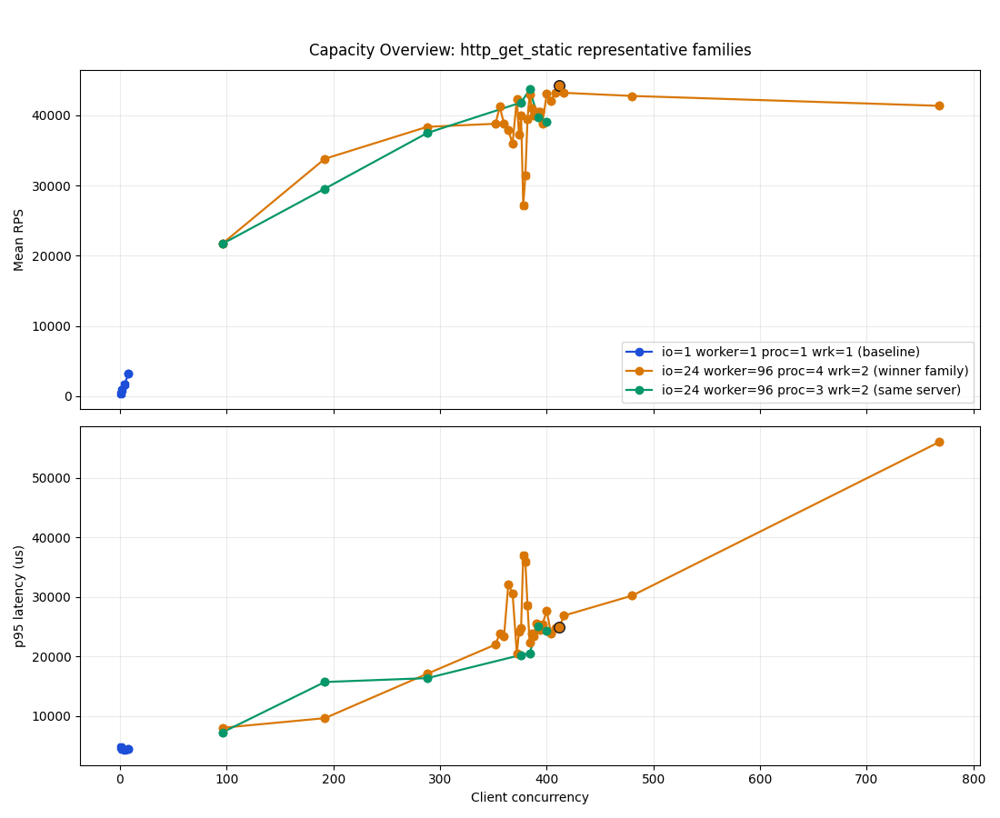
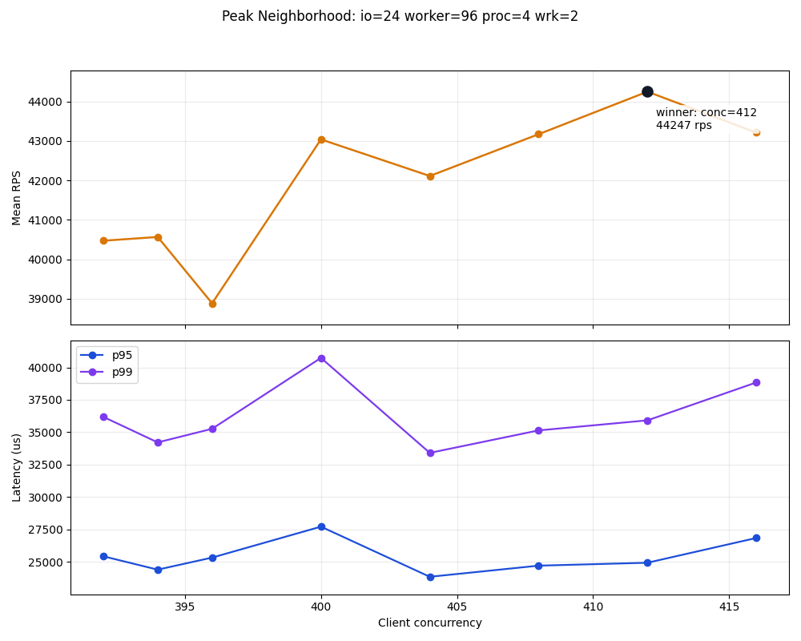
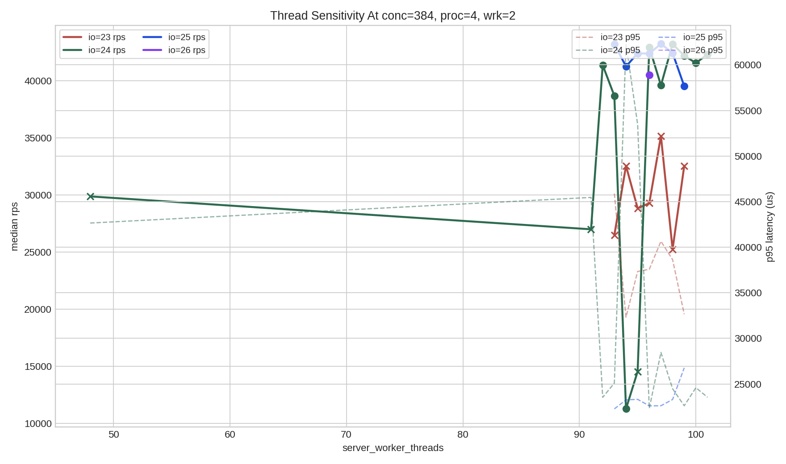
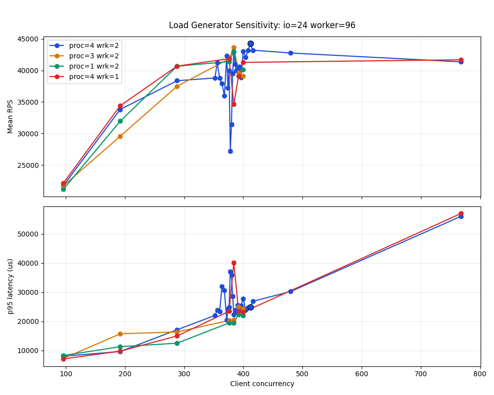

# Bsrvcore HTTP Benchmark Technical Report

## 1. Scope And Method

This run targets the `http_get_static` path only. The goal is not to claim a timeless machine-limit number. The goal is to locate a credible near-peak operating region on the current dual-host path, then explain how throughput and latency move around that region.

This point matters for interpreting the charts:

- topology: `dual-host-ssh`
- client host: `haomingbai-PC`
- client CPU: `20` logical CPUs, `13th Gen Intel(R) Core(TM) i9-13900H`
- client OS: `Fedora Linux 43 (Workstation Edition)`
- server host: `ubuntu-SYS-7048GR-TR`
- server CPU: `48` logical CPUs, `Intel(R) Xeon(R) CPU E5-2678 v3 @ 2.50GHz`
- server OS: `Ubuntu 24.04.4 LTS`
- server URL: `http://10.68.170.210:18080`
- command: `bash scripts/benchmark.sh ssh-run --scenario http_get_static --ssh-target server --ssh-remote-root /home/haomingbai/bsrvcore --server-host 10.68.170.210 --build-dir build --sweep-depth standard --output-dir /home/haomingbai/my_projects/bsrvcore/.artifacts/benchmark-results/20260331-dual-host-standard-refined`
- warmup / duration / cooldown: `1000 ms / 3000 ms / 500 ms`
- repetitions: `2`
- search shape: `58` coarse cells + `90` fine cells = `148` total cells
- winner rule: stable-first, then highest `mean_rps`, then lower `p95`, then lower `p99`
- reporting rule in this document: still use stable cells within `1%` of the winner as the strict near-peak band, but also discuss a wider `3%` operating band because this run's `1%` band collapses to one point

Because the load generator now runs on a separate machine, this report is more trustworthy than the earlier single-host ceiling for end-to-end behavior on the current path. It is still not a pure server-only limit: the result still includes the current client host, the current network path, and wrk-side shaping.

The formatted raw data is in [benchmark-report.json](benchmark-report.json).

## 2. Executive Summary

The exact top stable cell in this run is:

| scenario | io_threads | worker_threads | concurrency | client_processes | wrk_threads | mean_rps | p95_us | p99_us |
| --- | --- | --- | --- | --- | --- | --- | --- | --- |
| `http_get_static` | `24` | `96` | `412` | `4` | `2` | `44247.33` | `24942.84` | `35918.12` |

Strictly applying the old `1%` rule, the near-peak band contains only that single point. That is a useful result in itself: compared with the single-host report, the dual-host crest is much narrower and cleaner.

For practical tuning, the more useful band in this run is the stable `3%` operating band:

| pressure | mean_rps | p95_us | gap_to_top |
| --- | --- | --- | --- |
| `io24-worker96-conc412-proc4-wrk2` | `44247.33` | `24942.84` | `0.00%` |
| `io24-worker96-conc384-proc3-wrk2` | `43687.01` | `20529.11` | `1.27%` |
| `io25-worker97-conc384-proc4-wrk2` | `43250.83` | `22609.08` | `2.25%` |
| `io24-worker98-conc384-proc4-wrk2` | `43236.09` | `24475.01` | `2.29%` |
| `io25-worker93-conc384-proc4-wrk2` | `43226.04` | `22267.75` | `2.31%` |
| `io24-worker96-conc416-proc4-wrk2` | `43210.63` | `26851.49` | `2.34%` |
| `io24-worker96-conc408-proc4-wrk2` | `43170.03` | `24717.60` | `2.43%` |
| `io24-worker96-conc400-proc4-wrk2` | `43038.60` | `27724.19` | `2.73%` |
| `io24-worker96-conc384-proc1-wrk2` | `43012.03` | `19470.00` | `2.79%` |
| `io24-worker96-conc384-proc4-wrk2` | `42959.60` | `22321.59` | `2.91%` |

The most defensible recommendation from this run is:

- server near-peak center: `io_threads=24-25`
- worker is a secondary topology parameter on this `/ping` path; in the main sweep the broad safe neighborhood was roughly `worker_threads=93-99`
- client near-peak band on this path: mainly `concurrency=384-416`
- dominant loadgen family in the main sweep: `proc=4,wrk=2`
- targeted extension on `2026-04-01`: `wrk>2` created a few near-ties, but none beat `io24, worker96, conc412, proc4, wrk2`
- best lower-latency alternate near the crest: `proc=3,wrk=2` or `proc=1,wrk=2` at `conc=384`

## 3. Capacity Overview

The first chart compares the baseline against the high-throughput region and its nearby server-thread variants.

The main takeaways are:

- The single-thread baseline tops out at `3228.00 rps` (`io1-worker1-conc8-proc4-wrk1`). The top cell is `13.71x` higher, so the gain is real server-side and path-side scaling, not a tiny benchmark artifact.
- The useful crest now sits around `io=24-25`, `worker=96-98`, `conc=384-416`, with throughput in the `43k-44k` band.
- Dropping to `io22-worker96-conc384-proc4-wrk2` still reaches `41349.50 rps`, but that is already `6.55%` below the winner.
- Pushing up to `io26-worker96-conc384-proc4-wrk2` reaches only `40538.17 rps`, `8.39%` below the winner.
- The server pair `io23-worker93-99` is a bad neighborhood on this path. Most points there are unstable and land only around `25k-35k`, with p95 already in the `32-46 ms` range.

So the high-level conclusion from the first chart is clean: the dual-host run replaces the old same-host ambiguity with a narrower, more convincing crest centered on `io=24-25`. Moving below or above that center now costs a visible amount of throughput.

## 4. Peak Neighborhood

The next chart zooms into the richest near-peak family, `io24-worker96-proc4-wrk2`.

This family is informative because it shows both the real crest and the amount of local irregularity still left in a short dual-host sweep:

- `conc=288` reaches `38363.55 rps` at `17074.94 us` p95
- `conc=372` reaches `42319.99 rps` at `20450.16 us` p95
- `conc=384` reaches `42959.60 rps` at `22321.59 us` p95
- `conc=400` reaches `43038.60 rps` at `27724.19 us` p95
- `conc=408` reaches `43170.03 rps` at `24717.60 us` p95
- `conc=412` reaches `44247.33 rps` at `24942.84 us` p95
- `conc=416` reaches `43210.63 rps` at `26851.49 us` p95
- `conc=480` still reaches `42762.87 rps`, but p95 has stretched to `30211.20 us`

The curve is not perfectly monotonic. There are visible local dents around `conc=364-380`. The important point is that those dents do not move the center of gravity: the best stable concentration is still the `384-416` block, and the exact crest lands at `412`.

That gives a practical operating split:

- lower-latency high-throughput choice: stay near `conc=384` but use a better loadgen shape
- maximum throughput choice: `conc=412`, `proc=4`, `wrk=2`
- avoid pushing much beyond `416` unless you explicitly accept a larger p95 budget

## 5. Server Thread Sensitivity

The next chart fixes the client shape at `conc=384, proc=4, wrk=2` and varies server threads around the crest.

This chart shows a broad plateau, but only after the server enters the right IO region:

- `io24-worker92-conc384-proc4-wrk2`: `41384.56 rps`, `23529.99 us` p95
- `io24-worker96-conc384-proc4-wrk2`: `42959.60 rps`, `22321.59 us` p95
- `io24-worker98-conc384-proc4-wrk2`: `43236.09 rps`, `24475.01 us` p95
- `io25-worker93-conc384-proc4-wrk2`: `43226.04 rps`, `22267.75 us` p95
- `io25-worker97-conc384-proc4-wrk2`: `43250.83 rps`, `22609.08 us` p95
- `io26-worker96-conc384-proc4-wrk2`: `40538.17 rps`, `24536.30 us` p95

The practical reading here is deliberately conservative:

- `io23` is mostly the wrong neighborhood. Even `worker=97` only reaches `35178.94 rps`, and the family is largely unstable.
- Once the run enters `io24-25`, the worker plateau becomes broad. Many points in `worker=93-101` stay between roughly `42k` and `43.3k`.
- There are still pathological pockets inside the same family, for example `io24-worker94-conc384-proc4-wrk2` at only `11260.10 rps`. That is another reason to recommend a band, not a single magical worker number.

For this plain static GET path, `worker` should therefore be treated as a secondary runtime-topology knob rather than as evidence that the handler body is fundamentally worker-bound. The main tuning signal still comes from `io`, `concurrency`, and client shape.

So the robust server-side conclusion is:

- `io=24-25` is the clear center in this run
- worker does not need a magic exact value here; keeping it in the broad `93-99` neighborhood is good enough for this path
- moving down to `io=22` costs around `6%-7%`
- moving up to `io=26` costs around `8%`

## 6. Load Generator Sensitivity

Because this is now a dual-host run, the load generator still matters, but less chaotically than in the old same-host report. The chart below fixes the server at `io24-worker96` and compares client shapes.

At the same comparable server pair, the loadgen shape result is:

- exact top point: `proc=4,wrk=2` at `conc=412`, `44247.33 rps`, `24942.84 us` p95
- best alternate: `proc=3,wrk=2` at `conc=384`, `43687.01 rps`, `20529.11 us` p95, only `1.27%` below the top
- lower-latency alternate: `proc=1,wrk=2` at `conc=384`, `43012.03 rps`, `19470.00 us` p95, only `2.79%` below the top
- `proc=2,wrk=1` at `conc=384` still does well at `41284.79 rps`, but it is `6.70%` below the winner
- `proc=4,wrk=1` never becomes attractive here; even its best stable point at `conc=376` reaches only `41861.26 rps`, `5.39%` below the winner

That is an important dual-host result:

- `wrk=2` is the dominant choice on this path
- process fan-out matters less than it did on the single-host run
- several `wrk=2` shapes cluster within `1.3%-2.9%` of the top, which means client-side CPU interference is lower and the server-side tuning signal is cleaner

## 7. Targeted wrk And High-IO Extension

A follow-up targeted extension was run on `2026-04-01` to answer two explicit coverage gaps from the main sweep:

- `wrk_threads_per_process > 2`
- explicit `io=48` and `io=96` probes

That extension fixed the server-side anchor at `worker=96` and stored its raw artifacts in [../../.artifacts/benchmark-results/20260401-dual-host-extended-wrk-io/extended-report.md](../../.artifacts/benchmark-results/20260401-dual-host-extended-wrk-io/extended-report.md). The extension winner stayed with the existing main-shape baseline:

- `io24-worker96-conc412-proc4-wrk2`: `44918.95 rps`, `24435.56 us` p95

The `wrk>2` result is nuanced:

- `io24-worker96-conc384-proc4-wrk3`: `44562.18 rps`, `23673.08 us` p95, only `0.79%` below the extension winner
- `io24-worker96-conc412-proc4-wrk4`: `43949.01 rps`, `23974.73 us` p95, `2.16%` below the extension winner
- `io24-worker96-conc384-proc1-wrk4`: `44029.02 rps`, `19770.00 us` p95, `1.98%` below the extension winner
- `io24-worker96-conc384-proc1-wrk8`: `44081.94 rps`, `19969.44 us` p95, `1.86%` below the extension winner
- `io24-worker96-conc412-proc4-wrk3`: `41903.94 rps`, already `6.71%` below
- `io24-worker96-conc384-proc4-wrk4`: `40426.16 rps`, `10.00%` below

So `wrk>2` is worth knowing about, but not worth promoting to the default recommendation:

- more `wrk` can create new near-tie client shapes
- no `wrk>2` shape beat the existing `proc=4,wrk=2@conc412` winner
- aggressive extra per-process fan-out is still non-monotonic

The high-io probe is cleaner:

- `io48-worker96-conc412-proc4-wrk2`: `44488.80 rps`, `24382.06 us` p95, only `0.96%` below the extension winner
- `io96-worker96-conc384-proc4-wrk2`: `43167.23 rps`, `23648.33 us` p95, `3.90%` below
- `io96-worker96-conc412-proc4-wrk2`: `43113.32 rps`, `24770.39 us` p95, `4.02%` below
- `io96-worker96-conc768-proc4-wrk2`: `38513.65 rps`, `65918.72 us` p95, `14.26%` below
- `io48-worker96-conc768-proc4-wrk2` became unstable at `32184.78 rps`

That targeted extension does not overturn the main report:

- `io=24` remains the cleanest center
- `io=48` is a legitimate near-tie probe if you want a higher-io alternate
- `io=96` does not open a better crest on this path

## 8. What This Means For Dual-Host Benchmarking

This run is strong enough to replace the earlier same-host report as the main tuning reference for the current client/server path.

The disciplined way to read it is:

- The dual-host benchmark is valid for relative tuning.
  It cleanly separates the bad server-thread regions, the true crest around `io24-25`, and the over/under-threaded regions.
- The strict `1%` band is narrow.
  In this run it contains only the exact winner, so the crest should be treated as sharp rather than broad.
- The practical operating band is wider than the strict `1%` rule.
  Stable cells within `3%` of the top still form a useful operating plateau around `43k`.
- The result is end-to-end for the current path, not a pure server-only ceiling.
  It still includes the current client host and the current network path to `10.68.170.210`.

If the next step is to estimate pure server-side headroom, the right follow-up is a cleaner remote load path with the server fixed near `io24-25, worker96-98`, then a narrower client sweep from the second machine.

## 9. Recommended Configurations

For this server and this benchmark path:

- Best exact point from this run:
  `io=24, worker=96, conc=412, proc=4, wrk=2`
- Best balanced near-peak point:
  `io=24, worker=96, conc=384, proc=3, wrk=2`
  It is only `1.27%` below the top, but p95 drops from `24942.84 us` to `20529.11 us`.
- Best lower-latency near-peak point:
  `io=24, worker=96, conc=384, proc=1, wrk=2`
  It is `2.79%` below the top, but p95 drops further to `19470.00 us`.
- Best robust server-side alternate if you want to stay in the same thread neighborhood but avoid the exact winner point:
  `io=25, worker=97, conc=384, proc=4, wrk=2`
  It is `2.25%` below the top, with slightly lower p95 at `22609.08 us`.
- Best higher-io alternate from the targeted extension:
  `io=48, worker=96, conc=412, proc=4, wrk=2`
  It stayed within `0.96%` of the extension winner, but still did not beat the `io=24` center.

## 10. Artifacts

- Report: [benchmark-report.md](benchmark-report.md)
- Data: [benchmark-report.json](benchmark-report.json)
- Summary: [package/summary.md](./package/summary.md)
- Extension Report: [../../.artifacts/benchmark-results/20260401-dual-host-extended-wrk-io/extended-report.md](../../.artifacts/benchmark-results/20260401-dual-host-extended-wrk-io/extended-report.md)
- Extension Data: [../../.artifacts/benchmark-results/20260401-dual-host-extended-wrk-io/extended-report.json](../../.artifacts/benchmark-results/20260401-dual-host-extended-wrk-io/extended-report.json)
