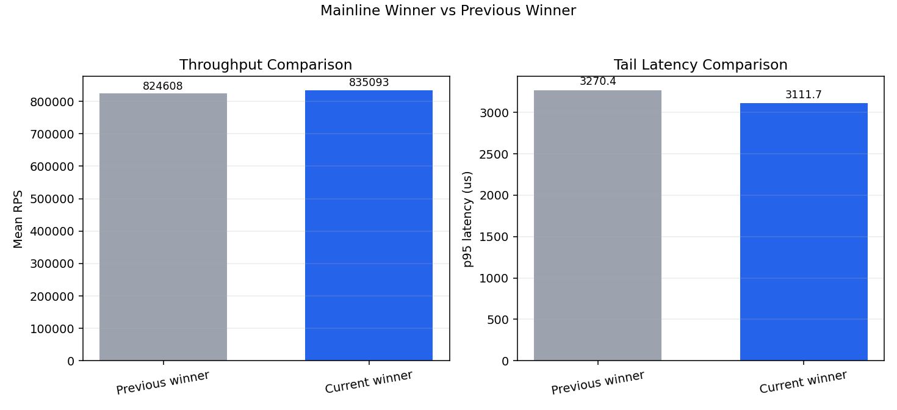
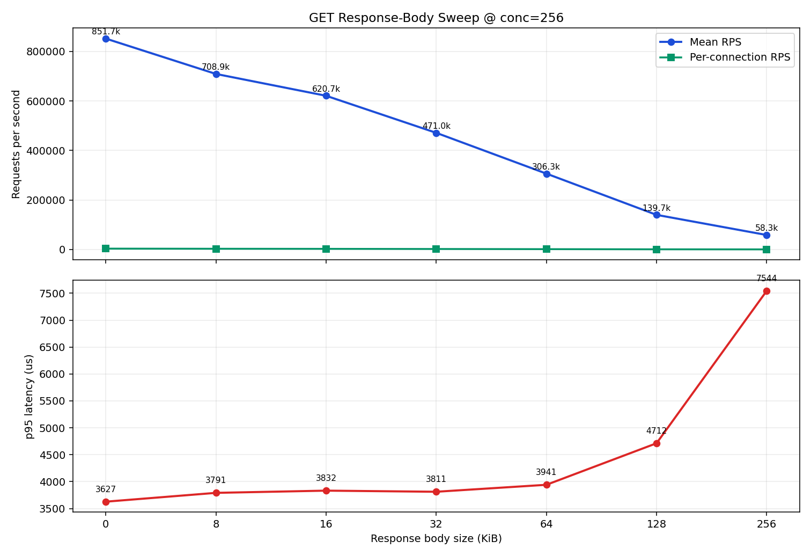
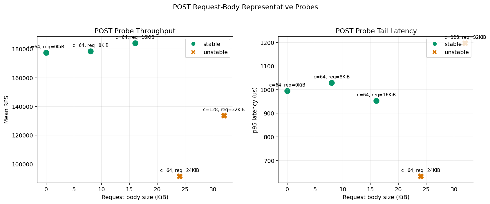

# Bsrvcore HTTP Benchmark Report (2026-04-25 Refresh)

## 1. Current Outcome

This refresh completed the mainline coarse+fine sweep using the same methodology as the previous report, and reused the same GET/POST probe set.

Current mainline winner:

- `io15-worker1-conc144-proc4-wrk2`
- `835092.66 rps`
- `p95 3111.71 us`, `p99 4421.86 us`
- stability: `stable`

Previous report winner:

- `io20-worker1-conc170-proc4-wrk2`
- `824608.14 rps`

Comparison:

- throughput delta: `+1.27%` (`+10484.52 rps`)
- p95 delta: `-158.70 us` (tail latency improved)
- Conclusion: this run improved versus the previous winner, and the required comparison is explicitly included.

In addition, this gain is a modest same-tier improvement (still within a ±5% band): the extra decision-path overhead introduced by Aspect complexity appears to be partly offset by improvements from memory allocation and temporary-object handling, producing a measurable but not aggressive net gain.

## 2. Mainline Scan (Coarse + Fine)

The run followed the same coarse-to-fine path as before: broad-grid coarse scan first, then refinement around the peak neighborhood.

Key results:

- A total of `399` cells were evaluated (coarse + fine)
- Stable cells: `363 / 399` (`90.98%`)
- The best stable winner converged to `io15-worker1-conc144-proc4-wrk2`
- The top stable neighborhood shows a plateau shape rather than a single-point spike

Top stable candidates (sorted by mean_rps):

- `io15-worker1-conc144-proc4-wrk2`, `835092.66 rps`, `p95 3111.71 us`
- `io15-worker1-conc150-proc4-wrk2`, `834093.52 rps`, `p95 3066.21 us`
- `io15-worker8-conc120-proc3-wrk2`, `829147.26 rps`, `p95 2154.30 us`
- `io16-worker3-conc120-proc4-wrk2`, `828999.34 rps`, `p95 2872.93 us`

## 3. GET Response-Body Sweep (Representative Points)

Scope aligned with the previous report: fixed `conc=256`, probing response sizes at `0, 8, 16, 32, 64, 128, 256 KiB`.

| response body | mean_rps | per_conn_rps | p95_us | stability |
| --- | ---: | ---: | ---: | --- |
| `0` | `851732.65` | `3327.08` | `3627.13` | stable |
| `8 KiB` | `708904.58` | `2769.16` | `3791.00` | stable |
| `16 KiB` | `620744.88` | `2424.78` | `3832.07` | stable |
| `32 KiB` | `471028.06` | `1839.95` | `3811.36` | stable |
| `64 KiB` | `306267.48` | `1196.36` | `3940.77` | stable |
| `128 KiB` | `139732.89` | `545.83` | `4712.44` | stable |
| `256 KiB` | `58335.78` | `227.87` | `7543.89` | stable |

Conclusion: the curve remains bandwidth-shaped, throughput declines monotonically as body size grows, and tail latency rises gradually with no broad instability region.

Compared with the previous report's same-scope point (`conc=256`):

- `resp=0`: `742756.95 -> 851732.65 rps` (`+14.67%`)
- `resp=256 KiB`: `55933.33 -> 58335.78 rps` (`+4.30%`)
- shape conclusion unchanged: throughput remains monotonic with payload growth

## 4. POST Request-Body Probes (Same Project Set)

Scope aligned with the previous report: the `conc=64` stable band plus the `conc=128, req=32KiB` boundary point.

| point | mean_rps | p95_us | stability |
| --- | ---: | ---: | --- |
| `conc=64, req=0` | `177435.16` | `995.11` | stable |
| `conc=64, req=8 KiB` | `178352.90` | `1028.71` | stable |
| `conc=64, req=16 KiB` | `184113.71` | `953.63` | stable |
| `conc=64, req=24 KiB` | `91563.18` | `633.67` | unstable |
| `conc=128, req=32 KiB` | `133731.61` | `1197.49` | unstable |

Note: in this run, POST became unstable at `24 KiB`, unlike the previous run where stability extended to `24 KiB`. This suggests the range is more sensitive to runtime jitter and should be tracked separately in follow-up regressions.

Interpretation for this probe set:

- A local stable platform is still visible at `conc=64` with request bodies up to `16 KiB`
- `req=24 KiB` is now unstable and throughput dropped sharply at that boundary
- The `conc=128, req=32 KiB` point remained unstable, so it should continue to be treated as a risk boundary rather than a target operating point

## 5. Environment And Scope

- CPU: `13th Gen Intel(R) Core(TM) i9-13900H`
- logical CPUs: `20`
- OS: `Fedora Linux 43 (Workstation Edition)`
- kernel: `6.19.11-200.fc43.x86_64`
- build: `Release`
- topology: single-host loopback

As before, hostname and IP details are intentionally omitted from the published report.

## 6. Artifact Index

- `docs/benchmark-results/benchmark-report.md`
- `docs/benchmark-results/benchmark-report.json`
- `docs/benchmark-results/benchmark-report-mainline-comparison.png`
- `docs/benchmark-results/benchmark-report-body-get-conc256.png`
- `docs/benchmark-results/benchmark-report-body-post-probes.png`
- `.artifacts/benchmark-results/20260424-185350Z/` (mainline coarse+fine)
- `.artifacts/benchmark-results/post-mainline-probes/` (GET/POST representative probes)
