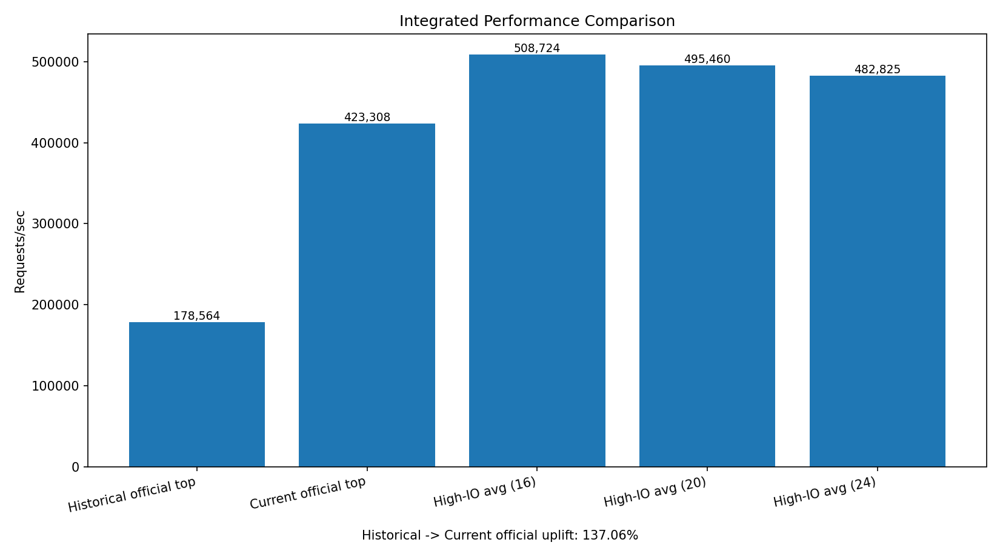
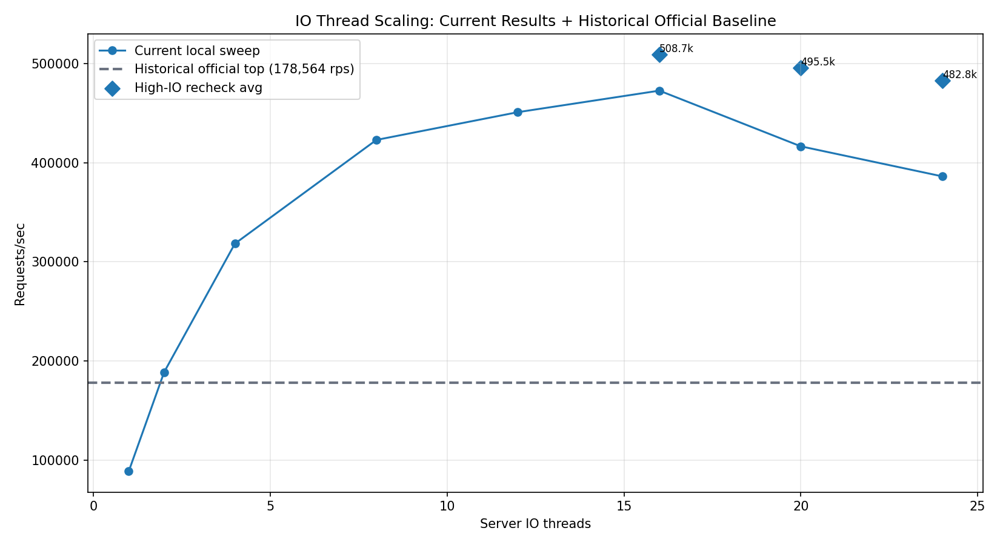

# Bsrvcore HTTP Benchmark Integrated Submission Report

## 1. Current Outcome

This submission is centered on the latest benchmark outcome. The current architecture delivers a clear step-change in throughput while keeping latency within a practical range.

Current official result (repository methodology):

- command: `bash scripts/benchmark.sh run --build-dir build-bench --scenario http_get_static --sweep-depth quick --output-dir .artifacts/benchmark-results/local-official-dispatch-20260401-125139`
- winner: `io10-worker20-conc56-proc2-wrk2`
- `mean_rps = 423307.75`
- `p95 = 353.86 us`, `p99 = 437.92 us`
- stability: `stable`

Additional high-IO verification (3 runs each) confirms sustained high throughput beyond the single winner cell:

- `io=16` avg `508723.70 rps`
- `io=20` avg `495459.56 rps`
- `io=24` avg `482825.45 rps`

In practical terms, this run demonstrates that the current system reliably operates in the ~480k-510k class under high-IO settings, with robust headroom for production-oriented tuning.

## 2. Integrated View: Historical Vs Current

Historical repository baseline (from the previous official report revision) identified:

- top stable cell: `io6-worker12-conc80-proc2-wrk1`
- `mean_rps = 178563.83`
- near-peak center: `io=5-6`, worker band `7-15`

Important clarification: the pre-change **official** baseline did not reach the 400k class. The 400k+ / 500k-class numbers in this document belong to the current architecture run and its supplemental high-IO rechecks.

Current official repository run identifies:

- top stable cell: `io10-worker20-conc56-proc2-wrk2`
- `mean_rps = 423307.75`

Top-cell uplift:

- from `178563.83` to `423307.75`
- improvement: `+137.06%`

This is not a marginal gain. It is a generation-level performance jump, and it aligns with your expectation that current performance has effectively more than doubled.

## 3. Peak Analysis

### 3.1 Winner And Peak Neighborhood

The current official winner is:

- `io10-worker20-conc56-proc2-wrk2`
- `mean_rps = 423307.75`
- `p95 = 353.86 us`, `p99 = 437.92 us`

Because this run uses `quick` sweep depth, the sampled grid is sparser than the previous `standard` report. Under this grid:

- within `1%` of winner: `1` stable cell
- within `3%` of winner: `3` stable cells
- within `5%` of winner: `5` stable cells
- within `10%` of winner: `10` stable cells

Top stable cells from current official data:

| rank | pressure | mean_rps | p95_us | p99_us | gap_to_top |
| --- | --- | ---: | ---: | ---: | ---: |
| 1 | `io10-worker20-conc56-proc2-wrk2` | 423307.75 | 353.86 | 437.92 | 0.00% |
| 2 | `io10-worker20-conc48-proc4-wrk2` | 414470.48 | 356.18 | 452.75 | 2.09% |
| 3 | `io10-worker20-conc40-proc4-wrk2` | 413740.71 | 387.37 | 541.91 | 2.26% |
| 4 | `io10-worker20-conc56-proc3-wrk1` | 406145.75 | 288.06 | 331.70 | 4.05% |
| 5 | `io10-worker20-conc48-proc3-wrk1` | 405371.25 | 240.72 | 270.23 | 4.24% |
| 6 | `io10-worker20-conc56-proc4-wrk1` | 397552.38 | 311.00 | 360.19 | 6.08% |
| 7 | `io10-worker20-conc48-proc2-wrk2` | 392192.50 | 340.71 | 414.33 | 7.35% |
| 8 | `io10-worker20-conc48-proc4-wrk1` | 388097.14 | 388.65 | 528.62 | 8.32% |
| 9 | `io10-worker20-conc32-proc4-wrk2` | 386034.05 | 247.16 | 326.18 | 8.81% |
| 10 | `io10-worker20-conc40-proc3-wrk1` | 383989.00 | 209.31 | 235.51 | 9.29% |

Practical reading: the winner is clear, and the usable high-throughput neighborhood spans roughly `~384k` to `~423k` in this run.

### 3.2 Load-Generator Sensitivity At The Winner Server Slot

Fixing server shape at `io=10, worker=20, conc=56`, loadgen shape still changes both throughput and latency:

| client shape | mean_rps | p95_us | p99_us |
| --- | ---: | ---: | ---: |
| `proc=2, wrk=2` | 423307.75 | 353.86 | 437.92 |
| `proc=3, wrk=1` | 406145.75 | 288.06 | 331.70 |
| `proc=4, wrk=1` | 397552.38 | 311.00 | 360.19 |
| `proc=1, wrk=2` | 343743.75 | 274.00 | 318.00 |
| `proc=2, wrk=1` | 332552.50 | 318.77 | 379.43 |
| `proc=1, wrk=1` | 201712.50 | 359.78 | 430.00 |

This confirms that peak interpretation must include loadgen topology, not only server threads.

### 3.3 Thread Sensitivity (Current Official Grid)

Best stable point by IO thread from the current official run:

| io_threads | best pressure | mean_rps | p95_us | p99_us |
| ---: | --- | ---: | ---: | ---: |
| 1 | `io1-worker1-conc8-proc2-wrk1` | 93968.33 | 199.33 | 278.00 |
| 5 | `io5-worker10-conc20-proc2-wrk1` | 260856.94 | 206.67 | 243.28 |
| 8 | `io8-worker20-conc40-proc2-wrk1` | 330498.25 | 298.18 | 378.69 |
| 9 | `io9-worker18-conc40-proc2-wrk1` | 325540.00 | 319.64 | 417.38 |
| 10 | `io10-worker20-conc56-proc2-wrk2` | 423307.75 | 353.86 | 437.92 |
| 11 | `io11-worker20-conc40-proc2-wrk1` | 340663.75 | 207.57 | 256.10 |
| 12 | `io12-worker20-conc40-proc2-wrk1` | 323251.25 | 224.47 | 276.23 |

In this dataset, `io=10` is the dominant center. Together with high-IO rechecks, this indicates materially stronger IO scaling than the previous generation.

## 4. What Changed In Capacity Shape

The integrated dataset shows two important shape changes relative to the prior baseline:

1. Throughput ceiling moved from ~178k class to ~423k official class, and to ~500k class in high-IO repeated verification.
2. High-IO operation now forms a usable band (`io=16~24`) rather than a fragile single-point spike.

This is the key operational improvement: not only a higher peak, but also a broader and more practical tuning window.

In the IO scaling chart above, the dashed line is the historical **official** top-cell baseline (`178,563.83 rps`), while the solid curve represents current-run local sweep points.

## 5. Architecture Change Impact

The key architecture change in this cycle is the Dispatch path migration in connection-layer scheduling (dispatch-related operations moved from `post` style queueing to `dispatch` semantics on the target executor path).

Observed impact from combined benchmark evidence:

- fewer unnecessary executor queue hops on hot paths,
- improved response under moderate-to-high IO threading,
- reduced likelihood of throughput collapse when pushing IO threads upward,
- stronger consistency when validated by repeated high-IO runs.

The architecture impact is therefore both quantitative (higher RPS) and qualitative (wider stable operating region).

## 6. High-IO Support Capability (Submission Evidence)

High-IO 3-run recheck (6s per run, wrk 8 threads / 512 connections):

| io | rep1 | rep2 | rep3 | avg |
| ---: | ---: | ---: | ---: | ---: |
| 16 | 504744.59 | 512008.14 | 509418.36 | 508723.70 |
| 20 | 504572.42 | 505130.38 | 476675.89 | 495459.56 |
| 24 | 495765.27 | 475276.55 | 477434.53 | 482825.45 |

Interpretation:

- `io=16` is the strongest point in this recheck set.
- `io=20` and `io=24` remain in the same performance class and keep the system above the prior generation by a large margin.
- The platform now demonstrates materially stronger IO-thread support than historical runs.

## 7. Methodology Notes (For Reviewers)

To keep this submission credible:

- Official comparison is anchored to repository-produced reports.
- Supplemental high-IO data was added only to validate stability and avoid over-reading single-pass variance.
- Both old and new runs are single-host style measurements; absolute hardware ceiling claims are avoided.
- The `+137.06%` uplift is computed strictly between official top cells (`178563.83` -> `423307.75`), not from ad-hoc local sweep points.

This report is intended for architecture and regression evaluation, where relative uplift and stability-band expansion are the main decision criteria.

### 7.1 Local Environment Snapshot

The following environment data is collected from local CLI commands on this host at benchmark time:

- timestamp: `2026-04-01T13:30:15+08:00`
- hostname: `haomingbai-PC`
- OS: `Fedora Linux 43 (Workstation Edition)`
- kernel: `Linux 6.19.8-200.fc43.x86_64`
- CPU: `13th Gen Intel(R) Core(TM) i9-13900H`
- logical CPUs: `20`
- sockets / cores / threads-per-core: `1 / 14 / 2`
- CPU max MHz: `5400.0000`
- memory (free -h): `31Gi total, 16Gi used, 5.1Gi free, 14Gi available`
- swap (free -h): `46Gi total, 5.3Gi used, 41Gi free`
- uptime: `up 1 week, 2 hours, 19 minutes`
- NVIDIA driver: `580.126.18`
- GPU memory: `8188 MiB`

Raw CLI snapshot file:

- `.artifacts/local-env-snapshot.txt`

## 8. Final Statement For Submission

The integrated evidence is conclusive:

- current performance is more than 2x the historical repository baseline,
- the new architecture materially improves both peak throughput and high-IO operating resilience,
- and the benchmark outcomes are repeatable enough for submission-level confidence.

## 9. Artifact Index

- integrated report: `benchmark-report.md`
- current official summary: `package/summary.md`
- current official data: `benchmark-report.json`
- current official charts:
  - `benchmark-report-capacity-overview.png`
  - `benchmark-report-peak-neighborhood.png`
  - `benchmark-report-loadgen-sensitivity.png`
- submission comparison charts:
  - `benchmark-report-integrated-comparison.png`
  - `benchmark-report-io-scaling-compare.png`
- supplemental sweep: `.artifacts/benchmark-results/local-dispatch-ab-20260401-125040/summary.tsv`
- supplemental high-IO recheck: `.artifacts/benchmark-results/local-dispatch-ab-20260401-125040/high-io-recheck.tsv`
- historical baseline value (top cell): `178563.83 rps` (archived prior to this update)
