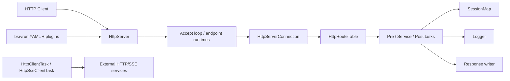

# Architecture Overview

bsrvcore is split into a small number of subsystems that deliberately keep the
public API compact while hiding most control-flow complexity in `src/`.

## Major Subsystems

- `include/bsrvcore/`: public API surface exposed to library users.
- `src/core/`: `HttpServer` startup, accept loop, executor publication, and
  shutdown coordination.
- `src/connection/server/`: per-connection request parsing, task lifecycle, and
  response writing.
- `src/route/`: route tree registration, matching, mounting, and aspect
  collection.
- `src/session/`: session context lookup, timeout refresh, and stale-entry
  cleanup.
- `src/connection/client/`: outbound HTTP/SSE client tasks.
- `src/bsrvrun/`: YAML-driven runtime assembly and plugin loading.

## Component View

## Ownership Model

- `HttpServer` owns route table, session map, thread-pool resources, and
  endpoint runtimes.
- Each accepted socket becomes one `HttpServerConnection`.
- One request creates one shared `HttpTaskSharedState`, then three lightweight
  task views may be built on top of it: pre, service, and post.
- Session state is stored in `SessionMap` and shared through `Context`.

## Source Anchors

- Server runtime: [`src/core/http_server_accept.cc`](../../src/core/http_server_accept.cc),
  [`src/core/http_server_runtime.cc`](../../src/core/http_server_runtime.cc)
- Request lifecycle:
  [`src/connection/server/http_server_task_lifecycle.cc`](../../src/connection/server/http_server_task_lifecycle.cc)
- Routing:
  [`src/route/http_route_table_registry.cc`](../../src/route/http_route_table_registry.cc),
  [`src/route/http_route_table_match.cc`](../../src/route/http_route_table_match.cc)
- Sessions:
  [`src/session/session_map.cc`](../../src/session/session_map.cc)
- Runtime container:
  [`src/bsrvrun/server_builder.cc`](../../src/bsrvrun/server_builder.cc)
