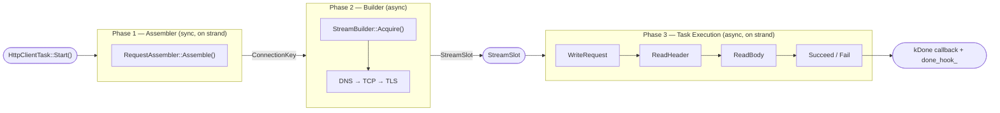
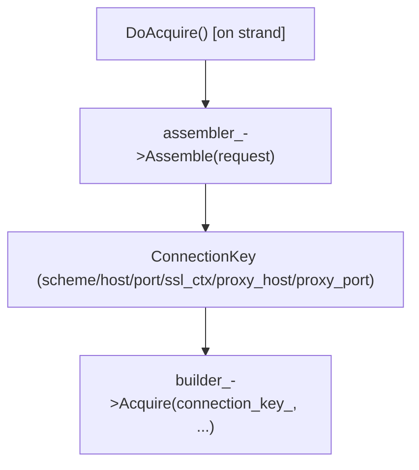
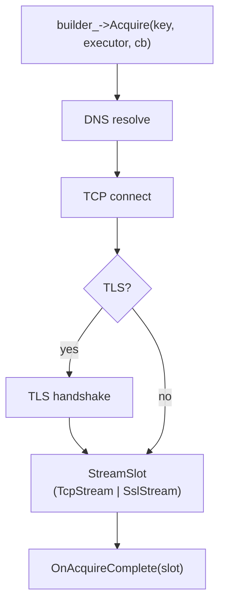
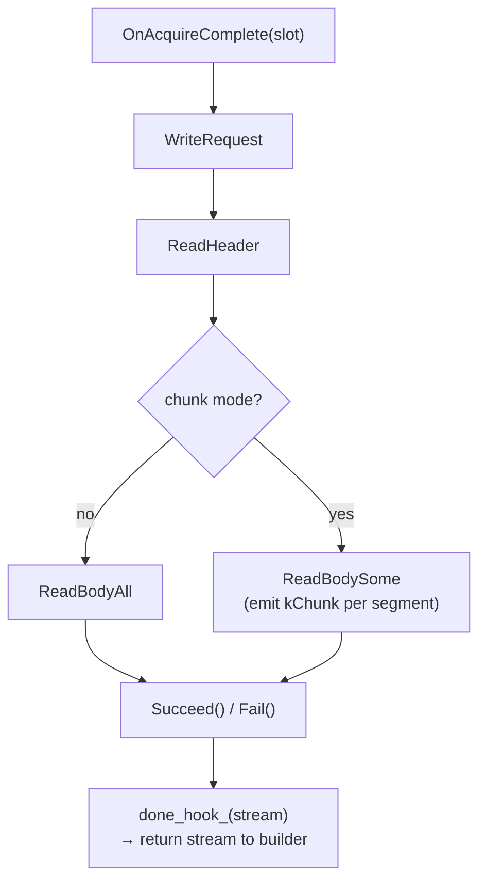
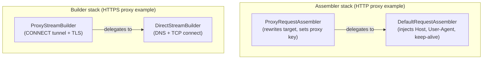
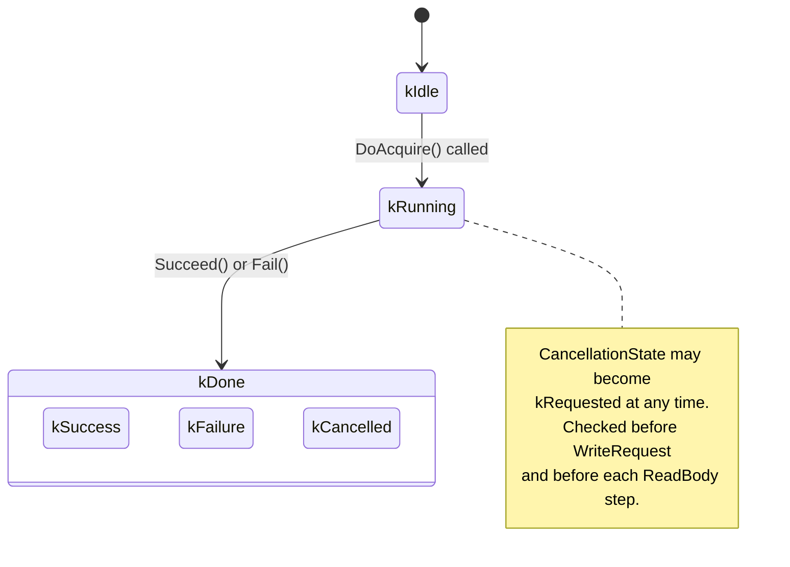

# HTTP Client Pipeline

This document describes the internal architecture of the outbound HTTP client
subsystem in bsrvcore. It focuses on control flow, component responsibilities,
and how the three phases compose — not on how to call the public API (see the
manual for that).

## Overview

Prior to the pipeline refactor, the client task mixed connection establishment,
header injection, and stream management into a single monolithic class. The
current design separates those concerns into three phases executed in strict
sequence:

1. **Assembler** — synchronous, on-strand header injection and
   `ConnectionKey` derivation.
2. **Builder** — asynchronous DNS/TCP/TLS stream acquisition.
3. **Task execution** — request write, response read, stage callbacks,
   lifecycle finalization.

Each phase is represented by an abstract base class with several concrete
implementations. The phases are composed through dependency injection at
task-creation time, allowing different combinations for plain HTTP, HTTPS,
CONNECT-tunnel HTTPS proxy, session-aware requests, and WebSocket
connections without conditional branches inside the execution core.

For the public API surface, the simple `Create*` factories wire the default
direct path. Advanced callers can also execute Phase 1 and Phase 2
explicitly, then hand the resulting stream to a Raw factory for Phase 3.

### Pipeline at a glance



The diagram reflects the strict data handoff: Phase 1 produces a `ConnectionKey`
consumed by Phase 2; Phase 2 produces a `StreamSlot` consumed by Phase 3;
Phase 3 emits stage callbacks and, on completion, returns the stream to Phase 2
via `done_hook_`.

## Three-Phase Pipeline

### Phase 1 — Assembler

`RequestAssembler` is called **synchronously** inside `DoAcquire()`, which
runs on the strand. Its contract is pure transformation: given a mutable
request, it injects standard headers and rewrites the target when needed,
then returns the `ConnectionKey` that identifies which physical connection
to acquire.



Concrete assemblers:

| Class | Responsibility |
|---|---|
| `DefaultRequestAssembler` | Injects `Host`, `User-Agent`, connection keep-alive; sets `ConnectionKey` from the request URL |
| `SessionRequestAssembler` | All of the above, plus reads/writes the cookie jar for the associated session |
| `ProxyRequestAssembler` | Rewrites the target to absolute-form (`http://host/path`); sets proxy host/port in the `ConnectionKey`; injects `Proxy-Authorization` if credentials are present |

Because the assembler runs on the strand and does no I/O, it holds no locks
and need not be thread-safe. Cookie-jar access is safe because cookies are
always accessed through the session, which is strand-local to the owning
client task.

### Phase 2 — Builder

`StreamBuilder` is called **asynchronously** immediately after
`DoAcquire()` returns. Its single entry point is:

```text
builder_->Acquire(connection_key_, executor, callback)
```

The callback receives a `StreamSlot` on completion. The builder is
responsible for everything between the `ConnectionKey` and a ready-to-use
stream: DNS resolution, TCP connect, and optional TLS handshake.



Concrete builders:

| Class | Responsibility |
|---|---|
| `DirectStreamBuilder` | DNS → TCP connect → optional TLS; the baseline implementation |
| `PooledStreamBuilder` | Decorator around an inner builder; serves a cached idle connection on hit; delegates to the inner builder on miss |
| `ProxyStreamBuilder` | DNS → TCP connect to the proxy; sends HTTP `CONNECT` to establish the tunnel; performs TLS over the tunnel for HTTPS targets |
| `WebSocketStreamBuilder` | DNS → TCP connect; skips TLS at this stage (the WebSocket upgrade task owns the TLS handshake) |

`StreamSlot` is a small value type that owns either a `unique_ptr<TcpStream>`
or a `unique_ptr<SslStream>`. Ownership is transferred from the builder to
`OnAcquireComplete`, and later from the task back to the builder (via
`done_hook_`) for potential pooling.

### Phase 3 — Task Execution

`OnAcquireComplete` is the entry point for the third phase. It takes ownership
of the `StreamSlot` and drives the full HTTP exchange:



Stage callbacks are emitted at fixed points:

- `kConnected` — immediately after `OnAcquireComplete` (stream is live)
- `kHeader` — after response headers have been parsed
- `kChunk` — once per chunk in chunk/stream mode (absent in full-body mode)
- `kDone` — after `Succeed()` or `Fail()` transitions the lifecycle

Callback delivery happens on the strand so callers never need to synchronize
against concurrent state mutations.

## Decorator Composition

Both `RequestAssembler` and `StreamBuilder` hierarchies follow the **decorator
pattern**: each concrete implementation focuses on exactly one concern, and
concerns are layered at task-creation time rather than hard-coded inside the
execution core. This is the key source of **functional orthogonality** in the
pipeline.

### Why decorators?

Consider the cross-product of features a client request might need:

- Cookie injection (session vs. no session)
- Proxy routing (no proxy / HTTP proxy / HTTPS CONNECT proxy)
- Connection reuse (direct vs. pooled)
- TLS handshake timing (normal vs. deferred for WebSocket)

With conditional logic inside one class, each new feature multiplies the
number of code paths. With decorators, each feature is a single wrapper that
composites cleanly with any other. Adding proxy support, for example, requires
only two new classes (`ProxyRequestAssembler` and `ProxyStreamBuilder`); the
rest of the pipeline is untouched.

### Composition matrix

The table below shows the main compositions used by the built-in direct
factories and by explicit advanced wiring:

| Scenario | Assembler | Builder stack (outer → inner) |
|---|---|---|
| Plain HTTP | `DefaultRequestAssembler` | `DirectStreamBuilder` |
| HTTPS | `DefaultRequestAssembler` | `DirectStreamBuilder` (ssl_ctx set) |
| Session-aware HTTP/S | `SessionRequestAssembler` | `DirectStreamBuilder` |
| Explicit HTTPS proxy (CONNECT) | `ProxyRequestAssembler` → `Default` | `ProxyStreamBuilder` → `Direct` |
| WebSocket (WS/WSS) | `DefaultRequestAssembler` | `WebSocketStreamBuilder` → `Direct` |

Arrows indicate decorator wrapping: `ProxyRequestAssembler` delegates to its
inner `DefaultRequestAssembler` for header injection, then applies proxy
rewriting on top. `ProxyStreamBuilder` delegates to its inner
`DirectStreamBuilder` for TCP connect, then sends the `CONNECT` request and
performs TLS on the resulting tunnel.



`PooledStreamBuilder` is another canonical decorator: it wraps **any**
`StreamBuilder` and adds an idle-connection cache keyed on `ConnectionKey`,
completely transparent to both the assembler above it and the inner builder
below it. Because pooling is a separate axis from proxy and WebSocket,
any combination — pooled+proxy, pooled+direct, non-pooled+WebSocket — is
achieved without changes to any participating class.

The default direct combinations are wired by the public `Create*` factories in
`http_client_task.cc`. Explicit proxy/custom transport combinations are
assembled by callers and then handed to `CreateHttpRaw(...)` or
`CreateHttpsRaw(...)` for Phase 3 execution.

## State Machine

The task lifecycle is governed by **three orthogonal state axes**. All
transitions occur on the strand, so no mutex is required.

### Axes

| Axis | States | Semantics |
|---|---|---|
| `LifecycleState` | `kIdle → kRunning → kDone` | Monotonically advances; `kRunning` means the async pipeline is in flight |
| `CompletionState` | `kNone → kSuccess / kFailure / kCancelled` | Only meaningful once `LifecycleState == kDone` |
| `CancellationState` | `kNone / kRequested` | Set independently at any point; checked at phase boundaries |

### Transition Diagram



Cancellation is cooperative: setting `CancellationState::kRequested` does not
immediately abort an in-flight async operation. The pipeline checks the flag
at the entry of each phase boundary and transitions to `kDone / kCancelled`
at the next safe checkpoint, then emits `kDone` with a cancellation reason.

## Raw Mode

Raw factories are the Phase 3 entry point for callers that already own a
ready stream. That includes unit tests, advanced transport composition, and
cases where Phase 1 + Phase 2 are performed explicitly outside the task.

In raw mode:

- Phase 1 and Phase 2 have already happened outside `HttpClientTask`.
- `CreateHttpRaw(...)` consumes a connected `TcpStream`.
- `CreateHttpsRaw(...)` consumes a connected + handshaked `SslStream`.
- Phase 3 then proceeds identically to assembled mode.

Internally, raw mode is represented by an `HttpClientTask::Impl` with no
assembler/builder attached and a pre-populated working stream.

## Connection Pooling and Stream Return

`PooledStreamBuilder` maintains a per-`ConnectionKey` queue of idle
`StreamSlot` objects. Idle connections expire after a configurable TTL; the
builder does not hold persistent background timers — expiry is checked lazily
on the next `Acquire` call for the same key.

When Phase 3 completes (either `Succeed()` or `Fail()`), the task calls
`done_hook_(stream)` with the stream it owns. The hook is a `std::function`
installed by `PooledStreamBuilder` at `Acquire` time. On success the stream
is placed back into the idle pool; on failure (or if the response indicated
`Connection: close`) the stream is discarded.

This return mechanism keeps pooling entirely inside the builder layer. The
task class has no knowledge of whether pooling is active; it simply calls the
hook and drops ownership.

## Source Anchors

- Assembler interface and concrete types:
  [`include/bsrvcore/connection/client/request_assembler.h`](../../include/bsrvcore/connection/client/request_assembler.h),
  [`src/connection/client/request_assembler.cc`](../../src/connection/client/request_assembler.cc)
- Builder interface and concrete types:
  [`include/bsrvcore/connection/client/stream_builder.h`](../../include/bsrvcore/connection/client/stream_builder.h),
  [`src/connection/client/stream_builder.cc`](../../src/connection/client/stream_builder.cc)
- `StreamSlot`:
  [`include/bsrvcore/connection/client/stream_slot.h`](../../include/bsrvcore/connection/client/stream_slot.h)
- Task public interface:
  [`include/bsrvcore/connection/client/http_client_task.h`](../../include/bsrvcore/connection/client/http_client_task.h)
- Task factories:
  [`src/connection/client/http_client_task.cc`](../../src/connection/client/http_client_task.cc)
- State machine and phase execution:
  [`src/connection/client/http_client_task_flow.cc`](../../src/connection/client/http_client_task_flow.cc)
