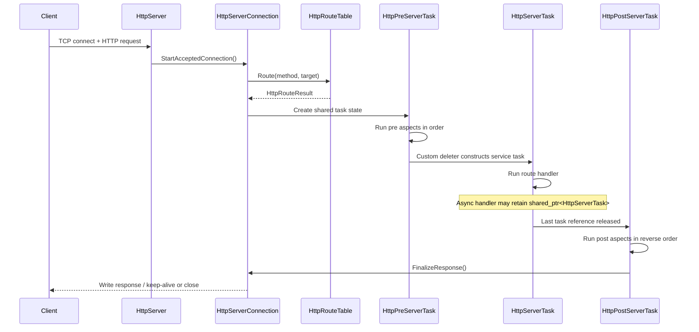

# Request Lifecycle

This is the core server-side flow for one inbound request.

## High-Level Sequence

## Important Details

- Route matching happens before task objects are created.
- All three phases share the same request, response, cookie cache, and route
  metadata through `HttpTaskSharedState`.
- Phase transitions happen in custom deleters, not in explicit "next phase"
  calls.
- Keeping `std::shared_ptr<HttpServerTask>` alive is the built-in mechanism for
  deferred/asynchronous response completion.

## Automatic vs Manual Response Finalization

Default behavior:

1. Handler/aspects mutate the accumulated response.
2. Post phase finishes.
3. `FinalizeResponse()` writes the full response automatically.

Manual mode:

1. Handler calls `SetManualConnectionManagement(true)`.
2. Handler/aspects are responsible for `WriteHeader()`, `WriteBody()`,
   `DoCycle()`, or `DoClose()`.
3. Lifecycle finalization skips automatic `DoWriteResponse()`.

## Failure Semantics

- If the stream or server is no longer available, delayed callbacks stop
  scheduling work.
- Aspect and handler exceptions are swallowed inside lifecycle loops; they do
  not automatically synthesize an error response.
- Closing the connection clears the shared `conn` pointer so late callbacks can
  detect that the request is no longer runnable.
