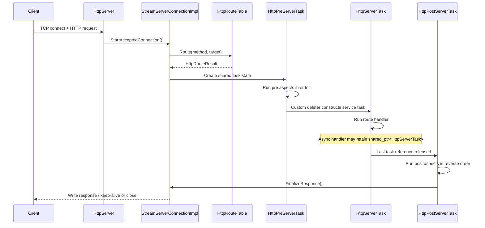

# Request Lifecycle

This is the core server-side flow for one inbound request.

## High-Level Sequence



## Important Details

- Route matching happens before task objects are created.
- All three phases share the same request, response, cookie cache, and route
  metadata through `HttpTaskSharedState`.
- Phase transitions happen in custom deleters, not in explicit "next phase"
  calls.
- Keeping `std::shared_ptr<HttpServerTask>` alive is the built-in mechanism for
  deferred/asynchronous response completion.

## Automatic vs Manual Response Finalization

Default behavior:

1. Handler/aspects mutate the accumulated response.
2. Post phase finishes.
3. `FinalizeResponse()` writes the full response automatically.

Manual mode:

1. Handler calls `SetManualConnectionManagement(true)`.
2. Handler/aspects are responsible for `WriteHeader()`, `WriteBody()`,
   `DoCycle()`, or `DoClose()`.
3. Lifecycle finalization skips automatic `DoWriteResponse()`.

## IO Thread Optimizations via const-ref Handler Parameters

Starting with bsrvcore v0.16.0, all handler and aspect virtual functions accept
`const std::shared_ptr<T>&` instead of `std::shared_ptr<T>` by value. This
optimization reduces atomic reference-count operations when handlers execute on
the IO thread:

### Performance Benefit

For a typical synchronous GET request:

- **Old signature**: `void Service(std::shared_ptr<HttpServerTask> task)`
  - Creates temporary copy on entry: atomic increment
  - Destroys copy on exit: atomic decrement
  - Cost: 2 atomic operations per handler invocation
  
- **New signature**: `void Service(const std::shared_ptr<HttpServerTask>& task)`
  - Passes reference to existing shared_ptr: no atomic operations
  - Cost: 0 atomic operations per handler invocation

On request paths with multiple aspects (e.g., 64-aspect chain), the savings
multiply: a single 64-aspect middleware setup saves ~128 atomic operations per
request.

### When const-ref is Safe

The const-ref parameter is **safe and sufficient** in three scenarios:

1. **Synchronous handlers**: Handler returns without retaining the shared_ptr.
2. **IO-bound handlers**: Handler submits IO work that completes synchronously
   (e.g., blocking `GetBody()`, `SetField()`).
3. **Framework-managed async**: Handler enqueues work using framework APIs that
   internally hold the shared_ptr (e.g., task schedulers, worker pools).

### Explicit Capture for Deferred Handlers

If a handler needs to execute **after** the handler function returns (e.g.,
deferred callback, CPU-bound task), it **must capture the shared_ptr explicitly**:

```cpp
server.AddRouteEntry(
    HttpRequestMethod::kGet, "/async-work",
    [](const std::shared_ptr<HttpServerTask>& task) {
      // Copy once from the const-ref parameter to extend lifetime.
      auto keep_alive = task;
      auto cpu_task = worker_pool->Enqueue(
          [keep_alive = std::move(keep_alive)]() {
            keep_alive->SetBody("expensive computation result");
          });
    });
```

Without the explicit capture, the shared_ptr is destroyed at function exit,
triggering post-phase and response finalization prematurely.

### Aspect Chain Execution

Pre and post aspects receive the same const-ref parameter and follow identical
rules:

- Post aspects run in **reverse order** as handlers are destroyed.
- If an aspect needs to defer work (e.g., logging to async storage), it must
  capture the const-ref explicitly.

## CPU Tasks and Async Semantics

When scheduling work on a CPU-bound thread pool or with system async (e.g.,
`std::async`), the task holder **must preserve the shared_ptr lifetime**:

```cpp
// ❌ Capturing only a reference can outlive the handler parameter.
auto cpu_task_bad = std::async(std::launch::async,
    [&task]() {
      cpu_expensive_computation();
      task->SetBody("result");  // ❌ dangling reference after handler returns
    });

// ✅ CPU work prolongs request lifetime
auto keep_alive = task;
auto cpu_task_good = std::async(std::launch::async,
    [keep_alive = std::move(keep_alive)]() {
      cpu_expensive_computation();
      keep_alive->SetBody("result");
    });
```

Passing `task` by value into `std::async` or copying it before a lambda capture
also preserves lifetime. What is unsafe is retaining only a reference to the
handler parameter after the handler returns.

## Failure Semantics

- If the stream or server is no longer available, delayed callbacks stop
  scheduling work.
- Aspect and handler exceptions are swallowed inside lifecycle loops; they do
  not automatically synthesize an error response.
- Closing the connection clears the shared `conn` pointer so late callbacks can
  detect that the request is no longer runnable.

## WebSocket Note

WebSocket upgrade introduces an additional lifecycle mode and post-phase
handoff rules. See:

- [WebSocket lifecycle](websocket-lifecycle.md)
