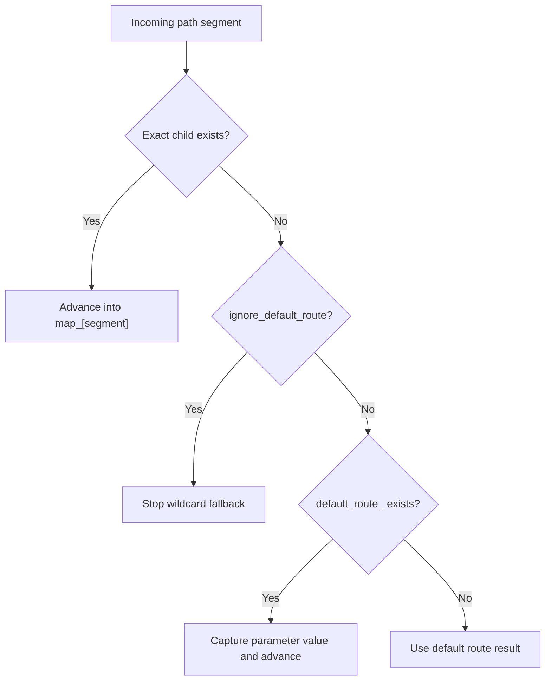
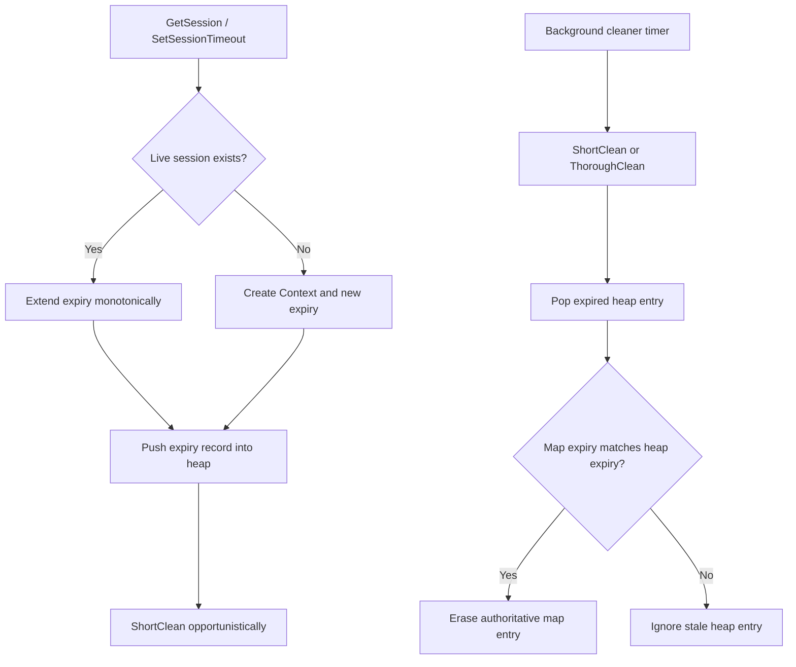

# Routing And Sessions

Routing and sessions are separate subsystems, but both rely on "cheap foreground
operations plus lazy cleanup" to keep the hot path predictable.

## Route Matching Model

Each HTTP method owns one route tree:

- static segments are stored in `map_`
- parameter segments share `default_route_`
- terminal layers hold handler/aspect/policy metadata
- connection/runtime hot paths keep allocator-backed internal route results,
  while public `HttpServer::Route()` converts to compatibility containers

## Aspect Ordering

- Global aspects are collected first.
- Method-specific global aspects are appended next.
- Matched subtree aspects are appended next in root-to-leaf order.
- Terminal aspects on the final matched route are appended last.
- Collection now appends directly into the destination aspect chain and avoids
  temporary per-layer vectors.
- Pre phase runs in collection order.
- Post phase runs in reverse order.

This gives the expected middleware nesting semantics.

## Session Storage Model

`SessionMap` stores:

- `map_`: authoritative session id -> context/expiry entry
- `pqueue_`: min-heap of expiry records

The heap may contain stale records because extending a session pushes a new
expiry instead of updating old heap entries in place.

## Change Safety Notes

- Do not make route matching mutate tree structure during request handling.
- Do not assume `pqueue_` and `map_` sizes are equal.
- Do not shorten session expiry for live sessions unless the public API is
  explicitly changed to allow that behavior.
- If mount/clone behavior changes, keep the current "validate first, mutate
  second" rule so failed mounts remain non-destructive.
