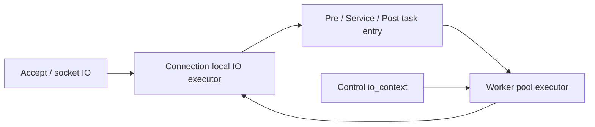

# Threading And Executors

bsrvcore uses different executor domains for different kinds of work. Most of
the implementation complexity comes from moving work between those domains
without breaking per-connection ordering.

## Executor Roles

- Worker pool executor:
  general server callbacks, route handlers wrapped as computing tasks, timer
  callbacks, and background cleanup.
- Endpoint I/O executors:
  accept loops, socket reads/writes, per-connection sequencing, and timer wait
  objects.
- Control I/O executor:
  server-level fallback executor while startup/shutdown is in progress.

## Execution Model

## Dispatch Rules

- `DispatchToConnectionExecutor()` is used for lifecycle entry so one
  connection's parse/handler/write steps stay serialized.
- `Post()` / `Dispatch()` on `HttpServer` and `HttpTaskBase` target the worker
  pool.
- `PostToIoContext()` / `DispatchToIoContext()` target a selected endpoint I/O
  executor.
- Task timers wait on an I/O executor, then post the callback back to the
  worker pool.

## REUSEPORT vs Fallback Mode

- If `SO_REUSEPORT` is available, each endpoint can build one acceptor per I/O
  shard and run one thread per shard.
- If `SO_REUSEPORT` is unavailable, bsrvcore falls back to one acceptor /
  `io_context` per endpoint and runs multiple `run()` threads on that context.
- The first endpoint decides the mode for the whole server so the published
  executor model stays consistent.

## Public naming

- Public headers should prefer the aliases from `bsrvcore/core/types.h` when
  referring to executor concepts.
- Use `IoExecutor` for type-erased I/O executor hand-off points and
  `IoContext` when a concrete `io_context` object is required.
- The goal is to keep public API vocabulary stable even if the underlying Boost
  type spellings are verbose or change across modules.

## Practical Rule For Changes

If a change touches socket state, parser state, or response write sequencing, it
should stay on the connection-local I/O executor. If it is general work that can
outlive a single socket operation, it usually belongs on the worker pool.
