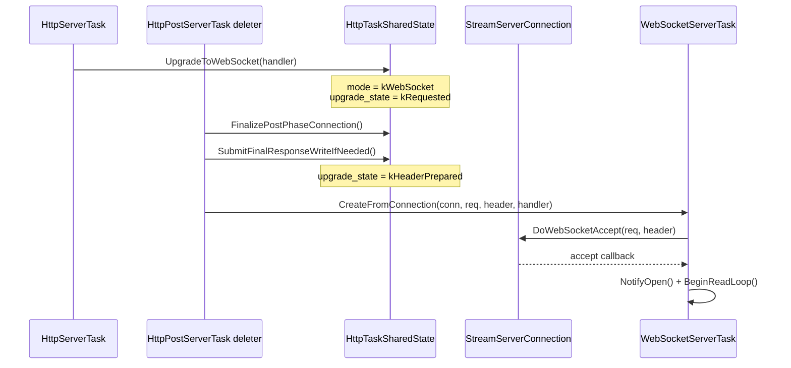

# WebSocket Lifecycle

This document captures how WebSocket changed lifecycle behavior in both server
and client paths.

It complements:

- [Request lifecycle](request-lifecycle.md)
- [Threading and executors](threading-and-executors.md)

## Why This Exists

Before WebSocket support, request finalization had two practical modes:

- automatic HTTP response write
- manual connection management

WebSocket introduces a third mode with different ownership and finalization
rules:

- HTTP phases still run (pre/service/post)
- final output is no longer a normal HTTP body write
- connection ownership is transferred to a long-lived WebSocket task

## Server-Side Lifecycle Model

### Three Connection Modes

`HttpTaskSharedState::connection_mode` now selects one of:

- `kAutomatic`
- `kManual`
- `kWebSocket`

The switch is resolved in post-phase finalization (`FinalizePostPhaseConnection`)
inside:

- `src/connection/server/http_server_task_lifecycle.cc`

### Upgrade State Machine

Upgrade state is tracked separately from connection mode:

- `kNone`
- `kRequested`
- `kHeaderPrepared`
- `kTaskStarted`

`kRequested` is set by `HttpServerTask::UpgradeToWebSocket(...)`.
`kHeaderPrepared` is set when post-finalization decides WebSocket path.
`kTaskStarted` is set after `WebSocketServerTask::Start()` begins real accept.

### Post-Phase Finalization Branch

At post task deleter time:

1. Automatic mode: submit normal HTTP response write.
2. Manual mode: skip auto write and execute manual keep-alive/close action.
3. WebSocket mode:
4. Prepare header-only upgrade submission state.
5. Build request/response-header snapshot.
6. Create `WebSocketServerTask` from connection.
7. Start async WebSocket accept.

This branch point lives in:

- `src/connection/server/http_server_task_lifecycle.cc`
- `src/connection/include/internal/server/http_server_task_detail.h`

## Server Upgrade Sequence

## Ownership And Lifetime

### Shared State Side

- HTTP phases share one `HttpTaskSharedState`.
- Connection pointer inside shared state is `AtomicSharedPtr<StreamServerConnection>`.
- On upgrade success path, shared state `conn` is cleared after task handoff.

### WebSocket Task Side

`WebSocketServerTask` now stores:

- `std::shared_ptr<StreamServerConnection> connection_`

instead of a weak pointer.

Reason: reduce timing-sensitive teardown windows where WebSocket task is alive
but connection has already been dropped by unrelated lifetime edges.

## Stream Abstraction Update

Internal connection types use `StreamServerConnection` for the abstract base and
`StreamServerConnectionImpl<S>` for the concrete stream template to reflect
that one connection object may host:

- HTTP request/response lifecycle
- WebSocket upgraded lifecycle

Key interface points used by `WebSocketServerTask`:

- `DoWebSocketAccept`
- `DoWebSocketRead`
- `DoWebSocketWrite`
- `DoWebSocketControl`
- `DoWebSocketClose`

Concrete transport behavior is implemented by the stream template layer in:

- `src/connection/include_exported/bsrvcore/internal/connection/server/stream_server_connection_impl.h`

## Client-Side Lifecycle Model

`WebSocketClientTask` uses a direct async flow:

1. precheck and cookie injection
2. resolve
3. connect
4. WebSocket handshake
5. open + read loop

Handshake completion now drives a single HTTP-stage callback surface:

- `OnHttpDone(const HttpClientResult&)`

`OnConnected` and `OnHeader` were removed from WebSocket client API to avoid
duplicated HTTP-stage abstractions that are not needed for WS task consumers.

## Client Session Integration

When a task is created from `HttpClientSession` WebSocket factories:

- matching cookies are injected before handshake
- handshake `Set-Cookie` values are synchronized back to session

Session-backed factories are in:

- `HttpClientSession::CreateWebSocketHttp`
- `HttpClientSession::CreateWebSocketHttps`
- `HttpClientSession::CreateWebSocketFromUrl`

## Error And Close Semantics

Server and client follow the same high-level rule:

- any transport error => report `OnError` then close once
- close is idempotent (`NotifyCloseOnce` guard)
- normal peer close (`websocket::error::closed`) is treated as non-error close

## Practical Change Rules

When modifying WebSocket behavior, keep these invariants:

1. Do not bypass post-phase finalization branch for server upgrade handoff.
2. Do not mix `kManual` and `kWebSocket` semantics in one finalize path.
3. Keep `connection_mode` and `websocket_upgrade_state` transitions monotonic.
4. Keep `WebSocketServerTask` close/error callbacks idempotent.
5. Keep session cookie sync in client handshake completion path.
