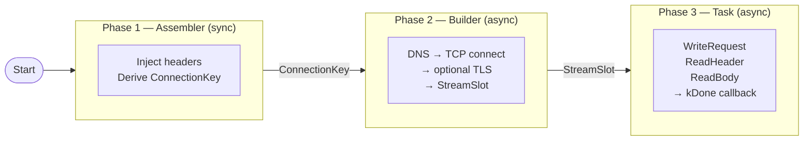

# Client tasks (HTTP/HTTPS + uploads + SSE)

This chapter maps to:

- `include/bsrvcore/connection/client/http_client_task.h`
- `include/bsrvcore/connection/client/http_client_session.h`
- `include/bsrvcore/connection/client/put_generator.h`
- `include/bsrvcore/connection/client/multipart_generator.h`
- `include/bsrvcore/connection/client/http_sse_client_task.h`
- `include/bsrvcore/connection/client/request_assembler.h`
- `include/bsrvcore/connection/client/sse_event_parser.h`
- `include/bsrvcore/connection/client/stream_builder.h`

## HttpClientTask

`HttpClientTask` runs **one** HTTP/HTTPS request.

Its executor model is explicit:

- I/O factories accept `IoContextExecutor`
- a second overload lets you provide a dedicated callback executor
- the simpler overload defaults callback delivery back onto the same executor
- `thread_pool::executor_type` is intentionally not accepted here

It reports progress using stage callbacks:

- `kConnected`
- `kHeader`
- `kChunk`
- `kDone`

Typical usage:

1. Create a task.
2. Optionally edit the request through `task->Request()` or `task->SetJson(...)`.
3. Register callbacks.
4. Call `Start()`.
5. Run your executor.

Minimal example:

```cpp
bsrvcore::IoContext ioc;

auto task = bsrvcore::HttpClientTask::CreateFromUrl(
  ioc.get_executor(),
  "http://127.0.0.1:8080/ping",
  bsrvcore::HttpVerb::get);

task->OnDone([](const bsrvcore::HttpClientResult& r) {
  if (r.ec || r.cancelled) {
    return;
  }
  // r.response is valid on success
});

task->Start();
ioc.run();
```

If you want callbacks on another `io_context`, use the two-executor overload:

```cpp
bsrvcore::IoContext io_ioc;
bsrvcore::IoContext callback_ioc;

auto task = bsrvcore::HttpClientTask::CreateHttp(
  io_ioc.get_executor(),
  callback_ioc.get_executor(),
  "127.0.0.1",
  "8080",
  "/ping",
  bsrvcore::HttpVerb::get);
```

### Raw stream factories

For advanced transport control, `HttpClientTask` also provides raw factories:

- `CreateHttpRaw(...)`
- `CreateHttpsRaw(...)`

These factories take an already-ready stream and skip DNS/connect/TLS setup in
the task:

- HTTP raw expects a connected `TcpStream`
- HTTPS raw expects a connected + handshaked `SslStream`

Example:

```cpp
bsrvcore::IoContext ioc;
bsrvcore::TcpStream stream(ioc.get_executor());

// ... connect stream.socket() yourself ...

auto task = bsrvcore::HttpClientTask::CreateHttpRaw(
  ioc.get_executor(),
  std::move(stream),
  "127.0.0.1",
  "/ping",
  bsrvcore::HttpVerb::get);
```

JSON helpers:

- `task->SetJson(value)` serializes the request body and sets `Content-Type: application/json`
- `result.ParseJsonBody(out)` parses `result.response.body()` and returns a `bsrvcore::JsonErrorCode`
- `result.TryParseJsonBody(out)` is the bool-only convenience wrapper

### HTTPS note

- `CreateFromUrl(executor, "https://...", ...)` now works without passing a TLS context.
- The library creates one shared client TLS context internally and loads system trust roots.
- If you need custom trust or client certificates, use the overload that takes `SslContextPtr`.

## PutGenerator and MultipartGenerator

These are **request builders** on top of `HttpClientTask`.

They do a first async phase:

1. read one or more `FileReader` objects
2. build the final request body in memory
3. return a ready-to-start `HttpClientTask`

So the split is:

- `PutGenerator` / `MultipartGenerator`: prepare the request
- `HttpClientTask`: execute the request

### PutGenerator example

```cpp
bsrvcore::IoContext ioc;

auto reader = bsrvcore::FileReader::Create(
  "/tmp/blob.bin",
  ioc.get_executor());

auto client = bsrvcore::PutGenerator::CreateFromUrl(
  ioc.get_executor(),
  "http://127.0.0.1:8080/upload");

client->SetFile(reader).SetContentType("application/octet-stream");

client->AsyncCreateTask(
  [](std::error_code ec, std::shared_ptr<bsrvcore::HttpClientTask> task) {
    if (ec || !task) {
      return;
    }

    task->OnDone([](const bsrvcore::HttpClientResult& r) {
      // final HTTP result
    });
    task->Start();
  });

ioc.run();
```

### MultipartGenerator example

```cpp
bsrvcore::IoContext ioc;

auto file_reader = bsrvcore::FileReader::Create(
  "/tmp/photo.jpg",
  ioc.get_executor());

auto client = bsrvcore::MultipartGenerator::CreateFromUrl(
  ioc.get_executor(),
  "http://127.0.0.1:8080/form");

client->AddTextPart("title", "demo")
    .AddFilePart("upload", file_reader, "photo.jpg", "image/jpeg");

client->AsyncCreateTask(
  [](std::error_code ec, std::shared_ptr<bsrvcore::HttpClientTask> task) {
    if (!ec && task) {
      task->Start();
    }
  });
```

Rules:

- `PutGenerator` builds one `PUT` request from one file.
- `MultipartGenerator` builds one `POST multipart/form-data` request.
- generator factories also take `io_context::executor_type`, matching `HttpClientTask`
- file parts require a field `name`
- default multipart filename is the file path basename
- default multipart content type is `application/octet-stream`
- generators are shared-only and created through `Create*`
- the ready callback receives an **unstarted** `HttpClientTask`

## Async waiters behind upload builders

Upload builders internally use async waiters to converge multiple file-read
callbacks before creating the final `HttpClientTask`.

If you need that pattern directly for your own code, see
[Async waiters](async-waiters.md).

## HttpSseClientTask

`HttpSseClientTask` is for **Server-Sent Events (SSE)**.

SSE is one long HTTP response where the server keeps sending text lines.
The client reads the stream again and again.

bsrvcore uses a pull loop:

1. `Start(cb)` connects, writes request, reads and validates response header.
2. Call `Next(cb)` repeatedly to pull more body bytes.

- Only one `Next()` can run at a time.
- `Next()` returns `result.chunk`: the new bytes since your last `Next()`.
- Normal stream end is `result.eof=true`.

Raw factories are also available for SSE:

- `CreateHttpRaw(...)`
- `CreateHttpsRaw(...)`

The same readiness rules apply:

- HTTP raw: connected `TcpStream`
- HTTPS raw: connected + handshaked `SslStream`

Example with `SseEventParser`:

```cpp
bsrvcore::IoContext ioc;
bsrvcore::SseEventParser parser;

auto task = bsrvcore::HttpSseClientTask::CreateFromUrl(
  ioc.get_executor(),
  "http://127.0.0.1:8080/events");

std::function<void()> pull_next;
pull_next = [task, &parser, &pull_next]() {
  task->Next([&parser, &pull_next](const bsrvcore::HttpSseClientResult& r) {
    if (r.ec || r.cancelled || r.eof) {
      return;
    }

    for (const auto& ev : parser.Feed(r.chunk)) {
      // ev.event / ev.data / ev.id / ev.retry_ms
    }

    pull_next();
  });
};

task->Start([&pull_next](const bsrvcore::HttpSseClientResult& r) {
  if (!r.ec && !r.cancelled) {
    pull_next();
  }
});

ioc.run();
```

## HttpClientSession

`HttpClientSession` is a factory object that creates `HttpClientTask` (and
`WebSocketClientTask`) instances that all share one **cookie jar**.

Use a session when:

- you need cookies to persist across multiple requests to the same host, or
- you want a single object to issue requests to several different hosts while
  keeping their cookies separated automatically.

Create a session with `HttpClientSession::Create()`, then call its factory
methods instead of `HttpClientTask::Create*`:

```cpp
bsrvcore::IoContext ioc;

auto session = bsrvcore::HttpClientSession::Create();

// First request — server may set a cookie.
auto t1 = session->CreateFromUrl(
    ioc.get_executor(),
    "http://example.com/login",
    bsrvcore::HttpVerb::post);

t1->SetJson(login_body);
t1->OnDone([&session, &ioc](const bsrvcore::HttpClientResult& r) {
    if (r.ec || r.cancelled) { return; }

    // Second request — the session automatically injects the cookie.
    auto t2 = session->CreateFromUrl(
        ioc.get_executor(),
        "http://example.com/api/data",
        bsrvcore::HttpVerb::get);

    t2->OnDone([](const bsrvcore::HttpClientResult& r2) {
        // r2.response contains the data
    });
    t2->Start();
});

t1->Start();
ioc.run();
```

The session also exposes `CreateHttp`, `CreateHttps`, and the corresponding
WebSocket factories — all with the same signatures as the static `HttpClientTask`
factories.

### Cookie jar management

The cookie jar is in-memory only and is not saved to disk. It is cleared when
the `HttpClientSession` object is destroyed. You can manage it directly:

```cpp
session->ClearCookies();           // remove all stored cookies
std::size_t n = session->CookieCount();  // count after expired cleanup
```

## Proxy support

The simple `CreateHttp` / `CreateHttps` / `CreateFromUrl` factories are still
supported and remain the recommended path for ordinary direct connections.

Proxy routing is now documented as an **explicit three-phase pipeline**:

1. `RequestAssembler::Assemble(...)` prepares the final request and derives the
   `ConnectionKey`.
2. `StreamBuilder::Acquire(...)` resolves/connects/builds the transport.
3. `CreateHttpRaw(...)` or `CreateHttpsRaw(...)` consumes that ready stream and
   runs the task execution phase.

For HTTPS over an HTTP proxy, the public building blocks are:

- `ProxyRequestAssembler`
- `ProxyStreamBuilder`
- `HttpClientTask::CreateHttpsRaw(...)`

Minimal shape:

```cpp
bsrvcore::HttpClientOptions opts;
bsrvcore::ProxyConfig proxy;
proxy.host = "proxy.corp.example";
proxy.port = "3128";

auto ssl_ctx =
    std::make_shared<bsrvcore::SslContext>(bsrvcore::SslContext::tls_client);
ssl_ctx->set_default_verify_paths();

auto assembler = std::make_shared<bsrvcore::ProxyRequestAssembler>(
    std::make_shared<bsrvcore::DefaultRequestAssembler>(),
    proxy);
auto builder = bsrvcore::ProxyStreamBuilder::Create(
    bsrvcore::DirectStreamBuilder::Create());

bsrvcore::HttpClientRequest request;
request.method(bsrvcore::HttpVerb::get);
request.target("/");
request.version(11);

auto assembled = assembler->Assemble(
    std::move(request), opts, "https", "api.example.com", "443", ssl_ctx);

builder->Acquire(
    assembled.connection_key,
    ioc.get_executor(),
    [&](boost::system::error_code ec, bsrvcore::StreamSlot slot) {
      if (ec || !slot.ssl_stream) {
        return;
      }

      auto task = bsrvcore::HttpClientTask::CreateHttpsRaw(
          ioc.get_executor(),
          std::move(*slot.ssl_stream),
          assembled.connection_key.host,
          std::string(assembled.request.target()),
          assembled.request.method(),
          opts);
      task->Request() = std::move(assembled.request);
      task->Start();
    });
```

The key idea is that **Raw factories are the public Phase 3 stream consumers**.
They are not legacy-only escape hatches; they are the intended handoff point
when you assemble transport yourself.

## Connection management

### Default: one connection per task

When you create a task through the static `HttpClientTask::Create*` factories,
each task opens its own TCP (or TLS) connection, uses it, and closes it when
done. This is the `DirectStreamBuilder` mode.

The same applies to tasks created through `HttpClientSession`: each task opens
its own connection. The session shares the cookie jar, not the connections.

### Connection pooling with PooledStreamBuilder

`PooledStreamBuilder` caches idle connections keyed by host + port + scheme so
that consecutive requests to the same endpoint reuse the same TCP/TLS session
instead of reconnecting.

You do not need to construct a `PooledStreamBuilder` manually for typical use
cases. It is the mechanism available if you build a custom task pipeline. Idle
connections are evicted after a configurable timeout (default: 60 seconds).

## Customisation hooks

Every `HttpClientTask` runs through a three-phase pipeline:



The supported customisation points for application code are:

- **Session** — use `HttpClientSession` to share a cookie jar across requests.
- **Explicit pipeline** — compose `RequestAssembler` + `StreamBuilder`, then
  hand the acquired stream to `CreateHttpRaw(...)` / `CreateHttpsRaw(...)`.
- **Proxy** — use `ProxyRequestAssembler` and `ProxyStreamBuilder` inside that
  explicit pipeline when transport routing must go through a proxy.

## Cancellation

Both HTTP and SSE client tasks support `Cancel()`.

Cancel is best-effort and closes the socket. After you cancel, callbacks may
still fire once with `cancelled=true`.

## WebSocket tasks

For WebSocket task APIs, upgrade semantics, and stage-1 limitations, see
[WebSocket tasks](websocket-tasks.md).

## Example sources

- `examples/client-tasks/http_request.cc`
- `examples/client-tasks/http_proxy_request.cc`
- `examples/client-tasks/sse_events.cc`

## Performance note

For compatibility, `SseEventParser::Feed(...)` returns `std::vector<SseEvent>`.
For performance-sensitive paths, prefer `SseEventParser::FeedAllocated(...)`
to consume allocator-backed event containers directly.

Next: [Examples](examples.md)
